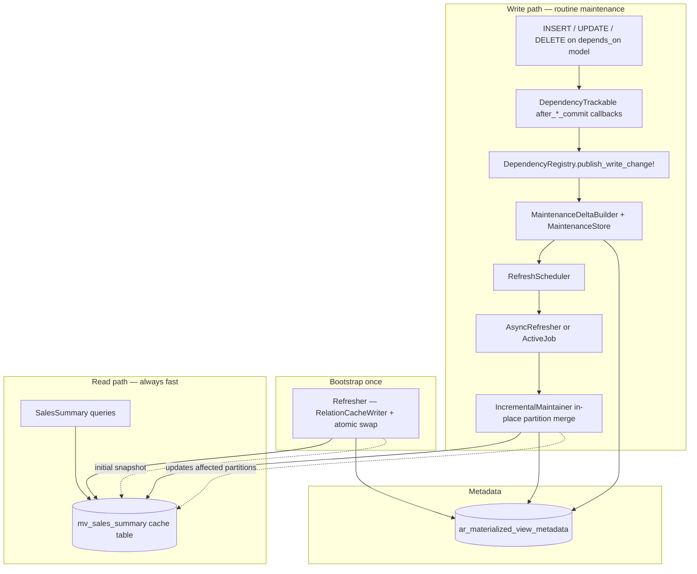

# activerecord-materialized

**Application-level materialized views for Rails and ActiveRecord** — precompute expensive analytical queries into cache tables, refresh them in the background when underlying data changes, and serve reads through a transparent ActiveRecord API.

> **Use case:** Your reporting page runs a 12-second join across six tables. Users visit once a day. MySQL has no native materialized views. This gem gives you PostgreSQL-style semantics in application code — writes trigger refresh, reads never pay for it.

> **Want to feel it?** A runnable Rails demo lives in [`demo/`](demo/) — compare raw vs. materialized timings side by side, mutate the underlying data, and watch the view go stale and then catch up.

[](activerecord-materialized.gemspec)
[](activerecord-materialized.gemspec)
[](LICENSE)

**Author:** [Michael Avrukin](https://github.com/mavrukin) · **License:** [MIT](LICENSE)

---

## Table of contents

- [Why this exists](#why-this-exists)
- [How it works](#how-it-works)
- [Research background](#research-background)
- [Features](#features)
- [Gotchas and trade-offs](#gotchas-and-trade-offs)
- [Installation](#installation)
- [Quick start](#quick-start)
- [Configuration](#configuration)
- [API reference](#api-reference)
- [Benchmark results](#benchmark-results)
- [When to use (and when not to)](#when-to-use-and-when-not-to)
- [Comparison with native materialized views](#comparison-with-native-materialized-views)
- [Development](#development)
- [Contributing](#contributing)

---

## Why this exists

Many Rails applications on **MySQL**, **MariaDB**, or **SQLite** hit the same wall:

| Symptom | Example |
|---------|---------|
| Complex joins + aggregations | `GROUP BY`, `DISTINCT`, correlated subqueries |
| Seconds per query even with indexes | Dashboards, admin reports, analytics APIs |
| Read-heavy, write-light | Thousands of reads/day, dozens of writes/day |
| No native MV support | Unlike PostgreSQL's `CREATE MATERIALIZED VIEW` |

**Materialized views** solve this by storing query results as a physical table and refreshing that snapshot when source data changes. High-end databases (PostgreSQL, Oracle, SQL Server) provide this natively. When your database cannot, **activerecord-materialized** implements the same read/refresh split in Ruby — without changing how developers query data.

### The problem with refresh-on-read

A naive approach refreshes the view on the first read after data changes. That punishes the unlucky user whose visit triggers a 10-second rebuild — and on a large database an implicit full rebuild can be catastrophic. This gem **never rebuilds implicitly**: a full materialization happens only via an explicit `rebuild!(confirm: true)`. Routine freshness is **incremental, on write** (dependency changes schedule partition-local maintenance after commit), and an unbuilt view stays correct via **read-through** to the source query until you build it.

---

## How it works

### Architecture



### Refresh lifecycle

1. **Define** a view class with a `materialized_from` block (returning an `ActiveRecord::Relation`) and `depends_on` models.
2. **Build** — an explicit `rebuild!(confirm: true)` materializes the source relation into the cache table via `RelationCacheWriter` + atomic swap. This is the only full-scan path and never fires implicitly; until it runs, reads fall through to the source (`cold_read :read_through`).
3. **Write** — any create/update/destroy on a `depends_on` model fires an `after_*_commit` callback (installed by `DependencyTrackable`) that calls `DependencyRegistry.publish_write_change!`.
4. **Accumulate** — for each affected view, `MaintenanceDeltaBuilder` records affected `GROUP BY` partition keys in `MaintenanceStore` (widens to all partitions when scope is unknown).
5. **Defer** — `after_*_commit` fires only once the writing transaction commits, so changes are batched naturally and a rolled-back transaction schedules nothing.
6. **Debounce** — rapid writes coalesce into one maintenance pass (configurable window).
7. **Maintain** — `IncrementalMaintainer` deletes and re-aggregates only affected partitions in the existing cache table (no DDL, no atomic swap on the hot path).
8. **Read** — once built, `where`, `find`, `count`, scopes query the cache table directly; reads before maintenance completes return the previous snapshot, reads after see updated partitions. Before the view is built, reads transparently fall through to the source query.

### Core components

| Component | Role |
|-----------|------|
| `ActiveRecord::Materialized::View` | Base model; DSL and query interface |
| `DependencyTrackable` | Installs `after_*_commit` callbacks on `depends_on` models |
| `DependencyRegistry` | Maps tables → view classes; publishes commit writes to affected views |
| `RefreshScheduler` | Dispatches `:async`, `:immediate`, or `:manual` strategies |
| `AsyncRefresher` | Debounced in-process background maintenance (tests: `flush!`) |
| `RefreshJob` | Optional ActiveJob wrapper for production workers |
| `ViewDefinition` | Inspects source relations for `GROUP BY` maintenance keys |
| `MaintenanceDeltaBuilder` | Maps ActiveRecord change payloads to affected partition keys |
| `MaintenanceStore` | Persists pending maintenance scope in metadata |
| `IncrementalMaintainer` | Hot-path partition delete + re-aggregate in existing cache table |
| `Refresher` | Orchestrates bootstrap/full refresh and incremental maintenance |
| `RelationCacheWriter` | Materializes relation rows; atomic table swap on full refresh |
| `QueryExpressions` | Portable Arel helpers (`sum_as`, `count_distinct_as`, …) for view definitions |
| `Metadata` | Tracks `dirty`, `maintenance_payload`, `last_refreshed_at`, `row_count`, errors |

---

## Research background

This gem applies decades of materialized-view and incremental-maintenance research to the application layer.

### Foundational surveys

| Topic | Reference |
|-------|-----------|
| **Materialized views monograph** | Chirkova & Yang, [*Materialized Views*](https://dsf.berkeley.edu/cs286/papers/mv-fntdb2012.pdf) (Foundations and Trends in Databases, 2012) — definitions, refresh strategies, view selection, query rewriting |
| **View maintenance taxonomy** | Gupta & Mumick, [*Maintenance of Materialized Views: Problems, Techniques, and Applications*](https://homepages.inf.ed.ac.uk/wenfei/qsx/reading/gupta95maintenance.pdf) (IEEE Data Engineering Bulletin, 1995) — when full vs incremental refresh is appropriate |

### Incremental view maintenance

| Topic | Reference |
|-------|-----------|
| **Warehousing & decoupled sources** | Zhuge et al., [*View Maintenance in a Warehousing Environment*](https://sigmodrecord.org/publications/sigmodRecord/9506/pdfs/568271.223848.pdf) (SIGMOD 1995) — maintaining views when base data lives outside the warehouse |
| **Higher-order deltas** | Ahmad et al., [*DBToaster: Higher-order Delta Processing for Dynamic, Frequently Fresh Views*](https://arxiv.org/pdf/1207.0137) (VLDB 2012) — recursive finite-differencing for low-latency view refresh |
| **Factorized IVM (F-IVM)** | Nikolic & Olteanu, [*Incremental View Maintenance with Triple Lock Factorization Benefits*](https://www.cs.ox.ac.uk/dan.olteanu/papers/no-sigmod18.pdf) (SIGMOD 2018) — factorized higher-order maintenance for conjunctive queries and aggregates |
| **IVM survey (recent)** | Olteanu, [*Recent Increments in Incremental View Maintenance*](https://arxiv.org/pdf/2404.17679) (PODS 2024 Gems) — fine-grained complexity and modern IVM engines |

### Systems & dataflow approaches

| Topic | Reference |
|-------|-----------|
| **Differential dataflow** | McSherry et al., [*Differential Dataflow*](https://www.cidrdb.org/cidr2013/Papers/CIDR13_Paper111.pdf) (CIDR 2013) — incremental computation over changing data with multi-version state |
| **Application-layer precomputation** | Gjengset et al., [*Noria: dynamic, partially-stateful data-flow for high-performance web applications*](https://www.usenix.org/system/files/osdi18-gjengset.pdf) (OSDI 2018) — partially-stateful dataflow that incrementally maintains query results for web backends |

### Practical references

| Topic | Reference |
|-------|-----------|
| **Production reference** | [PostgreSQL: REFRESH MATERIALIZED VIEW](https://www.postgresql.org/docs/current/sql-refreshmaterializedview.html) — `CONCURRENTLY` refresh, separate read/refresh paths |
| **Benchmark schema** | Leis et al., [*How Good Are Query Optimizers, Really?*](https://dl.acm.org/doi/10.1145/3035918.3064035) (VLDB 2015) — [Join Order Benchmark](https://github.com/gregrahn/join-order-benchmark) used in this repo's benchmark suite |

**Design choice:** After a one-time bootstrap, routine refresh uses **incremental view maintenance (IVM)** by default. Following Gupta & Mumick, aggregate views with `GROUP BY` are maintained by recomputing only **affected partitions** (group keys) and merging them into the existing cache table — no table rebuild, no atomic swap on the hot path. Writes on `depends_on` models accumulate partition keys from ActiveRecord change payloads; maintenance deletes stale partition rows and inserts freshly aggregated replacements. Use `refresh_mode :full` when a view cannot be maintained incrementally.

---

## Features

- **Refresh on write** — dependency changes schedule background refresh; reads never block on rebuild
- **Transparent ActiveRecord API** — `where`, `find`, `count`, scopes, associations on cache tables
- **Relation-based sources** — `materialized_from` blocks return `ActiveRecord::Relation` (no raw SQL strings)
- **Portable aggregations** — `QueryExpressions` helpers build Arel for `SUM`, `COUNT`, `AVG`, etc.
- **Incremental maintenance by default** — partition-local re-aggregation for `GROUP BY` views; no cache-table rebuild on routine refresh
- **Atomic table swap on bootstrap only** — initial full materialization + rename when the cache is first built or on `refresh_mode :full`
- **Debounced async refresh** — coalesce rapid writes (PostgreSQL NOTIFY + worker pattern)
- **ActiveJob integration** — offload refresh to Sidekiq, GoodJob, Solid Queue, etc.
- **Dependency tracking** — `depends_on` models; ActiveRecord commit callbacks detect writes
- **Metadata table** — `last_refreshed_at`, `dirty`, `row_count`, `refresh_duration_ms`, errors
- **Staleness safety net** — optional `max_staleness` + rake tasks for cron-driven refresh
- **Rails generators** — `activerecord_materialized:install`, `activerecord_materialized:view`
- **Rake tasks** — `materialized:refresh_all`, `materialized:refresh_stale`
- **Benchmark suite** — JOB-schema SQLite database with multi-second analytical queries

---

## Gotchas and trade-offs

| Gotcha | Detail |
|--------|--------|
| **Eventual consistency** | Between a write and background refresh completing, reads return the previous snapshot. Same trade-off as `REFRESH MATERIALIZED VIEW CONCURRENTLY` in PostgreSQL. |
| **`depends_on` is required** | The gem cannot infer dependencies from a relation. Declare every model (or table) whose writes should trigger refresh. Prefer model classes (`depends_on LineItem`) so commit callbacks are wired automatically. |
| **Maintenance scope** | Partition keys are taken from ActiveRecord change payloads when possible (`create`/`update`/`destroy` with equality on `GROUP BY` columns). Unbounded writes widen to all partitions (in-place, still no DDL). |
| **Non-aggregate views** | Views without `GROUP BY` fall back to full refresh (`refresh_mode :full` or atomic swap). Join-heavy maintenance (Larson & Zhou) is not automatic yet. |
| **Full refresh escape hatch** | `refresh_mode :full` or `refresh!(force: true)` rebuilds via atomic swap — use for recovery or non-maintainable views. |
| **Table-name-only `depends_on`** | Symbol/string table names work, but refresh-on-write requires a resolvable ActiveRecord model for that table. Raw SQL writes bypass callbacks and will not trigger refresh. |
| **SQLite vs MySQL in dev** | The benchmark uses SQLite. Production behavior is adapter-agnostic, but test atomic swap on your target database. |
| **In-process async default** | Default `refresh_dispatcher: :async` uses a background thread. **Use ActiveJob in production** so refresh work runs on job workers, not Puma threads. |
| **No automatic indexes** | Cache tables are created from query results. Add indexes on cache columns you filter/sort on. |
| **Storage** | Cache tables duplicate data. Plan disk usage accordingly. |
| **Nested transactions** | Refresh is scheduled on the transaction where the write occurred; rollback clears pending refreshes for that transaction. |

---

## Installation

Add to your Gemfile:

```ruby
gem "activerecord-materialized"
```

Install the metadata migration:

```bash
bin/rails generate activerecord_materialized:install
bin/rails db:migrate
```

---

## Quick start

Generate a view model:

```bash
bin/rails generate activerecord_materialized:view SalesSummary
```

Define the view:

```ruby
class SalesSummary < ActiveRecord::Materialized::View
  extend ActiveRecord::Materialized::QueryExpressions

  self.table_name = "mv_sales_summary"

  materialized_from do
    line_items = LineItem.arel_table
    orders = Order.arel_table
    products = Product.arel_table

    LineItem
      .joins(:order, :product)
      .group(products[:category])
      .select(
        products[:category],
        sum_as(line_items[:amount], as: :revenue),
        count_distinct_as(orders[:id], as: :order_count)
      )
  end

  depends_on LineItem, Order, Product
  refresh_on_change :async
  refresh_debounce 30.seconds
  max_staleness 12.hours

  before_refresh { Rails.logger.info("Refreshing #{name}") }
end
```

Sources must be `ActiveRecord::Relation` objects built with standard query APIs and Arel — not raw SQL strings. Extract complex relations to a module or class method when a view definition grows large (see `spec/support/view_sources.rb` and `benchmark/support/source_relations.rb` in this repo).

Provision the (empty) cache table with a migration generated from the relation, so it exists at deploy time:

```bash
bin/rails generate activerecord_materialized:migration SalesSummary
bin/rails db:migrate
```

Build the view once (e.g. in a deploy task) — the only full-scan path, never implicit:

```ruby
SalesSummary.rebuild!(confirm: true)
```

Then query like any ActiveRecord model:

```ruby
# Served from the mv_sales_summary cache table — never triggers a rebuild.
# (Before the view is built, this reads through to the source query instead.)
SalesSummary.where("revenue > ?", 10_000).order(revenue: :desc)
```

Refresh strategies:

| Strategy | Behavior |
|----------|----------|
| `:async` (default) | After commit, debounced, via background thread or ActiveJob |
| `:immediate` | Synchronous refresh on each write (blocks writers) |
| `:manual` | Mark dirty only; call `refresh!` or rake tasks explicitly |

### Incremental maintenance (default)

For `GROUP BY` aggregate views, no extra configuration is required. The gem:

1. Inspects the `materialized_from` relation to derive maintenance partition keys (`GROUP BY` columns).
2. Accumulates affected partition keys from dependency writes (via ActiveRecord commit callbacks).
3. On refresh, deletes and re-inserts only those partitions in the existing cache table.

Optional overrides when you need explicit control:

```ruby
class SalesSummary < ActiveRecord::Materialized::View
  incremental_keys :category # override inferred GROUP BY keys
  refresh_mode :full         # opt out of incremental maintenance
  # incremental_from { ... } # optional: override auto-scoped maintenance relation
end
```

---

## Configuration

```ruby
# config/initializers/activerecord_materialized.rb
ActiveRecord::Materialized.configure do |config|
  config.default_refresh_strategy = :async
  config.default_refresh_debounce = 30.seconds
  config.refresh_dispatcher = :active_job   # :async for in-process thread
  config.refresh_queue_name = :materialized_views
  config.default_max_staleness = 12.hours
  config.atomic_swap_refresh = true
  config.metadata_table_name = "ar_materialized_view_metadata"
end
```

---

## API reference

### Class methods

| Method | Description |
|--------|-------------|
| `rebuild!(confirm: true)` | **Explicit** full materialization from the `materialized_from` relation — the only full-scan path; never fires implicitly |
| `refresh!` | Incremental maintenance only (no-op on an unbuilt view); never rebuilds |
| `refresh_if_stale!` | Incremental maintenance when materialized and stale |
| `materialized?` | Whether the view has been built (warm) and reads serve from the cache |
| `dirty?` | Whether a dependency change is pending maintenance |
| `stale?` | Whether view is dirty or exceeds `max_staleness` |
| `last_refreshed_at` | Timestamp of last successful refresh |
| `refreshing?` | Whether a refresh is in progress |
| `resolved_source` | The current `ActiveRecord::Relation` used for refresh |

### DSL

| Macro | Description |
|-------|-------------|
| `materialized_from { relation }` | Block returning the source `ActiveRecord::Relation` |
| `depends_on(*models_or_tables)` | Register dependencies; writes trigger refresh |
| `refresh_on_change(strategy)` | `:async`, `:immediate`, or `:manual` |
| `refresh_debounce(duration)` | Coalesce rapid writes before refreshing |
| `refresh_mode(mode)` | `:incremental` (default) or `:full` |
| `cold_read(strategy)` | Read behavior before the view is built: `:read_through` (default), `:serve_stale`, or `:raise` |
| `incremental_from { relation }` | Optional override for scoped maintenance relation |
| `incremental_keys(*columns)` | Optional override for inferred `GROUP BY` keys |
| `max_staleness(duration)` | Optional time-based safety refresh via rake/cron |
| `before_refresh` / `after_refresh` | Refresh lifecycle callbacks |

### QueryExpressions

Include or extend `ActiveRecord::Materialized::QueryExpressions` when defining aggregations:

| Helper | Arel equivalent |
|--------|-----------------|
| `sum_as(attr, as: :name)` | `SUM(...)` |
| `avg_as(attr, as: :name)` | `AVG(...)` |
| `count_as(attr, as: :name)` | `COUNT(...)` |
| `count_distinct_as(attr, as: :name)` | `COUNT(DISTINCT ...)` |
| `count_all_as(as: :name)` | `COUNT(*)` |
| `min_as` / `max_as` | `MIN` / `MAX` |

### Rake tasks

```bash
bin/rails materialized:refresh_all     # incremental maintenance pass
bin/rails materialized:refresh_stale
bin/rails materialized:rebuild         # intentional full materialization
bin/rails materialized:verify          # raise on cache-table schema drift
```

---

## Benchmark results

The included benchmark uses a [Join Order Benchmark](https://github.com/gregrahn/join-order-benchmark)-style schema on SQLite. On the **xlarge** dataset (~2M `cast_info` rows):

| Query | Source relation | MV read | Speedup |
|-------|-----------------|---------|---------|
| `gender_pairing_stats` | ~7.4s | ~0.3ms | ~21,000× |
| `company_movie_cross` | ~7.4s | ~0.4ms | ~20,000× |
| `person_movie_network` | ~13.3s | ~0.7ms | ~20,000× |
| `cast_coappearance` | ~19.7s | ~0.4ms | ~49,000× |

Run locally:

```bash
bundle install
JOB_SCALE=xlarge bundle exec rake benchmark:setup   # ~few minutes
bundle exec rake benchmark:slow
bundle exec rake benchmark:verify_updates           # refresh-on-write proof
```

See [benchmark/DATA.md](benchmark/DATA.md) for dataset scales and setup details.

---

## When to use (and when not to)

**Good fit:**

- Expensive read-mostly reporting queries on MySQL/MariaDB/SQLite
- Dashboards and admin pages where sub-second reads matter
- Infrequent or batched writes to underlying tables
- Acceptable eventual consistency between write and background refresh

**Poor fit:**

- Real-time, strongly consistent reads (use live queries or replicas)
- Very frequent writes where full refresh cost exceeds query cost
- Tiny queries where materialization overhead isn't worth it
- Views where you cannot enumerate all `depends_on` tables

---

## Comparison with native materialized views

| Capability | PostgreSQL native | activerecord-materialized |
|------------|-------------------|---------------------------|
| Precomputed snapshot | ✅ | ✅ |
| Transparent reads | ✅ (query rewrite or direct) | ✅ (ActiveRecord model) |
| Refresh on dependency change | Manual / trigger / pg_cron | ✅ automatic via `depends_on` |
| Background refresh | `REFRESH ... CONCURRENTLY` | ✅ async / ActiveJob |
| Incremental refresh | Limited (IVM extensions) | ✅ default partition-local IVM for `GROUP BY` views |
| Atomic swap during refresh | ✅ CONCURRENTLY | ✅ table rename |
| Database portability | PostgreSQL only | ✅ any ActiveRecord adapter |

---

## Development

```bash
git clone https://github.com/mavrukin/activerecord-materialized.git
cd activerecord-materialized
bin/setup            # bundle install + git hooks + Sorbet RBIs
bin/ci               # RuboCop, Sorbet, and the full test suite
bundle exec rake benchmark:setup
bundle exec rake benchmark
```

Maintainers: see [RELEASING.md](RELEASING.md) for the gem publishing process.

---

## Contributing

Bug reports and pull requests are welcome at [github.com/mavrukin/activerecord-materialized](https://github.com/mavrukin/activerecord-materialized).

---

## License

MIT © [Michael Avrukin](https://github.com/mavrukin)
