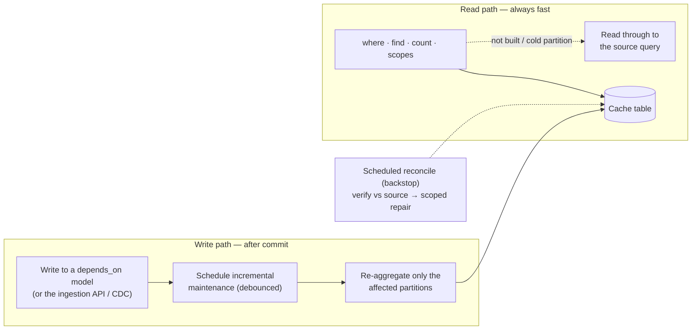

<p align="center">
  <picture>
    <source media="(prefers-color-scheme: dark)" srcset="https://raw.githubusercontent.com/mavrukin/activerecord-materialized/main/assets/png/lockup-horizontal-dark.png">
    
  </picture>
</p>

# activerecord-materialized

**Materialized views for Rails apps on databases that don't have them** — precompute an expensive query into a cache table, refresh it in the background when the underlying data changes, and read it through a transparent ActiveRecord API.

[](https://rubygems.org/gems/activerecord-materialized)
[](https://github.com/mavrukin/activerecord-materialized/actions/workflows/ci.yml)
[](https://rubydoc.info/gems/activerecord-materialized)
[](activerecord-materialized.gemspec)
[](activerecord-materialized.gemspec)
[](LICENSE)

> **Use case:** Your reporting page runs a 12-second join across six tables. Users visit once a day. MySQL has no native materialized views. This gem gives you PostgreSQL-style semantics in application code — writes trigger refresh, reads never pay for it.

- **Reads stay fast** — queries hit a small precomputed table, not a multi-second join.
- **Freshness is automatic** — a write to a `depends_on` model schedules background maintenance; you never refresh by hand.
- **Nothing blocks on a rebuild** — refresh is incremental and on-write, never on-read; a full rebuild happens only when you explicitly ask for it.
- **It's just ActiveRecord** — `where`, `find`, `count`, aggregations, and scopes work unchanged; an unbuilt view still returns correct results by reading through to the source (batch iteration like `find_each` needs the view built — see [Gotchas](#gotchas-and-trade-offs)).
- **It's portable** — works on MySQL, MariaDB, and SQLite, which have no native materialized views.

> 🚀 **New here? Start with the [Getting started tutorial](docs/getting-started.md)** — a hands-on, fully tested walkthrough from install to refresh-on-write.
>
> 🧪 **Want to feel it?** A runnable Rails demo lives in [`demo/`](demo/) — compare raw vs. materialized timings side by side, mutate the data, and watch the view go stale and catch up.

**Author:** [Michael Avrukin](https://github.com/mavrukin) · **License:** [MIT](LICENSE)

---

## Table of contents

- [Why this exists](#why-this-exists)
- [Database compatibility](#database-compatibility)
- [Installation](#installation)
- [Quick start](#quick-start)
- [How it works](#how-it-works)
- [Research background](#research-background)
- [Features](#features)
- [Gotchas and trade-offs](#gotchas-and-trade-offs)
- [When to use (and when not to)](#when-to-use-and-when-not-to)
- [Benchmark results](#benchmark-results)
- [Documentation](#documentation)
- [Versioning · Development · Contributing · License](#versioning)

---

## Why this exists

Many Rails applications on **MySQL**, **MariaDB**, or **SQLite** hit the same wall: complex joins and aggregations (`GROUP BY`, `DISTINCT`, correlated subqueries) that take seconds per query even with indexes, on read-heavy, write-light data — and no native `CREATE MATERIALIZED VIEW` to lean on.

**Materialized views** solve this by storing query results as a physical table and refreshing that snapshot when source data changes. PostgreSQL, Oracle, and SQL Server provide this natively; when your database can't, **activerecord-materialized** implements the same read/refresh split in Ruby, without changing how you query.

The trap it avoids is **refresh-on-read**: refreshing on the first read after a change punishes the unlucky user whose visit triggers a multi-second rebuild — and on a large database an implicit full rebuild can be catastrophic. This gem **never rebuilds implicitly**. A full materialization happens only via an explicit `rebuild!(confirm: true)`; routine freshness is **incremental, on write** (dependency changes schedule partition-local maintenance after commit); and an unbuilt view stays correct via **read-through** to the source until you build it.

---

## Database compatibility

Integration-tested in CI on every push to `main` — real **MySQL** and **PostgreSQL** via Docker containers, **SQLite** in process. Each badge reflects that adapter's integration workflow; see [integration testing](docs/integration-testing.md) to run the matrix locally or add a database.

| Database      | CI status |
|---------------|-----------|
| MySQL 8       | [](https://github.com/mavrukin/activerecord-materialized/actions/workflows/db-mysql.yml) |
| PostgreSQL 16 | [](https://github.com/mavrukin/activerecord-materialized/actions/workflows/db-postgres.yml) |
| SQLite 3      | [](https://github.com/mavrukin/activerecord-materialized/actions/workflows/db-sqlite.yml) |

---

## Installation

Add to your Gemfile:

```ruby
gem "activerecord-materialized"
```

Install the metadata migration:

```bash
bin/rails generate activerecord_materialized:install
bin/rails db:migrate
```

---

## Quick start

The **[Getting started tutorial](docs/getting-started.md)** is the recommended first read — a hands-on walkthrough (every example is executed by the test suite) from `bundle install` to a view that refreshes itself on write. The condensed reference follows.

Generate a view model:

```bash
bin/rails generate activerecord_materialized:view SalesSummary
```

Define the view — a `materialized_from` block returning an `ActiveRecord::Relation` (standard query API + Arel, never a raw SQL string) plus the `depends_on` models whose writes should refresh it:

```ruby
class SalesSummary < ActiveRecord::Materialized::View
  extend ActiveRecord::Materialized::QueryExpressions

  self.table_name = "mv_sales_summary"

  materialized_from do
    line_items = LineItem.arel_table
    orders = Order.arel_table
    products = Product.arel_table

    LineItem
      .joins(:order, :product)
      .group(products[:category])
      .select(
        products[:category],
        sum_as(line_items[:amount], as: :revenue),
        count_distinct_as(orders[:id], as: :order_count)
      )
  end

  depends_on LineItem, Order, Product
  refresh_on_change :async
  refresh_debounce 30.seconds
  max_staleness 12.hours
end
```

Provision the (empty) cache table from the relation, then build the view once — the only full-scan path, never implicit:

```bash
bin/rails generate activerecord_materialized:migration SalesSummary
bin/rails db:migrate
```

```ruby
SalesSummary.rebuild!(confirm: true)
```

Then query it like any ActiveRecord model:

```ruby
# Served from the mv_sales_summary cache table — never triggers a rebuild.
# (Before the view is built, this reads through to the source query instead.)
SalesSummary.where("revenue > ?", 10_000).order(revenue: :desc)
```

Refresh strategies (`refresh_on_change`, or `config.default_refresh_strategy`):

| Strategy | Behavior |
|----------|----------|
| `:async` (default) | After commit, debounced, via background thread or ActiveJob |
| `:immediate` | Synchronous refresh on each write (blocks writers) |
| `:manual` | Mark dirty only; call `refresh!` or the rake tasks explicitly |

For `GROUP BY` views — and for a `SELECT DISTINCT a, b` "distinct lookup", whose projected columns partition it exactly like `GROUP BY a, b` — incremental maintenance is automatic, no extra configuration. See [Architecture](docs/architecture.md) for the maintenance internals and override knobs (`incremental_keys`, `refresh_mode :full`, `partition_key_for` for joined-table keys), and the [API reference](docs/api-reference.md) for full configuration.

---

## How it works

The library splits the **write path** (maintenance) from the **read path** (always fast). A write to a `depends_on` model — or a change fed through the ingestion API / CDC — schedules incremental, partition-local maintenance *after commit*; reads hit the cache table directly, and an unbuilt view reads through to the source.



The only full scan is the explicit `rebuild!(confirm: true)`; routine refresh never rebuilds. For the accurate, full architecture — the refresh lifecycle, the component catalog, summary-delta vs scoped-recompute maintenance, and the ingestion/CDC/reconciliation paths — see **[Architecture](docs/architecture.md)**.

---

## Research background

This gem applies decades of materialized-view and incremental-maintenance research to the application layer.

### Foundational surveys

| Topic | Reference |
|-------|-----------|
| **Materialized views monograph** | Chirkova & Yang, [*Materialized Views*](https://dsf.berkeley.edu/cs286/papers/mv-fntdb2012.pdf) (Foundations and Trends in Databases, 2012) — definitions, refresh strategies, view selection, query rewriting |
| **View maintenance taxonomy** | Gupta & Mumick, [*Maintenance of Materialized Views: Problems, Techniques, and Applications*](https://homepages.inf.ed.ac.uk/wenfei/qsx/reading/gupta95maintenance.pdf) (IEEE Data Engineering Bulletin, 1995) — when full vs incremental refresh is appropriate |

### Incremental view maintenance

| Topic | Reference |
|-------|-----------|
| **Warehousing & decoupled sources** | Zhuge et al., [*View Maintenance in a Warehousing Environment*](https://sigmodrecord.org/publications/sigmodRecord/9506/pdfs/568271.223848.pdf) (SIGMOD 1995) — maintaining views when base data lives outside the warehouse |
| **Higher-order deltas** | Ahmad et al., [*DBToaster: Higher-order Delta Processing for Dynamic, Frequently Fresh Views*](https://arxiv.org/pdf/1207.0137) (VLDB 2012) — recursive finite-differencing for low-latency view refresh |
| **Factorized IVM (F-IVM)** | Nikolic & Olteanu, [*Incremental View Maintenance with Triple Lock Factorization Benefits*](https://www.cs.ox.ac.uk/dan.olteanu/papers/no-sigmod18.pdf) (SIGMOD 2018) — factorized higher-order maintenance for conjunctive queries and aggregates |
| **IVM survey (recent)** | Olteanu, [*Recent Increments in Incremental View Maintenance*](https://arxiv.org/pdf/2404.17679) (PODS 2024 Gems) — fine-grained complexity and modern IVM engines |

### Systems & dataflow approaches

| Topic | Reference |
|-------|-----------|
| **Differential dataflow** | McSherry et al., [*Differential Dataflow*](https://www.cidrdb.org/cidr2013/Papers/CIDR13_Paper111.pdf) (CIDR 2013) — incremental computation over changing data with multi-version state |
| **Application-layer precomputation** | Gjengset et al., [*Noria: dynamic, partially-stateful data-flow for high-performance web applications*](https://www.usenix.org/system/files/osdi18-gjengset.pdf) (OSDI 2018) — partially-stateful dataflow that incrementally maintains query results for web backends |

### Practical references

| Topic | Reference |
|-------|-----------|
| **Production reference** | [PostgreSQL: REFRESH MATERIALIZED VIEW](https://www.postgresql.org/docs/current/sql-refreshmaterializedview.html) — `CONCURRENTLY` refresh, separate read/refresh paths |
| **Benchmark schema** | Leis et al., [*How Good Are Query Optimizers, Really?*](https://dl.acm.org/doi/10.1145/3035918.3064035) (VLDB 2015) — [Join Order Benchmark](https://github.com/gregrahn/join-order-benchmark) used in this repo's benchmark suite |

**Design choice:** After a one-time bootstrap, routine refresh uses **incremental view maintenance (IVM)** by default. Following Gupta & Mumick, aggregate views with `GROUP BY` are maintained by recomputing only **affected partitions** (group keys) and merging them into the existing cache table — no table rebuild, no atomic swap on the hot path. Use `refresh_mode :full` when a view cannot be maintained incrementally.

---

## Features

- **Refresh on write** — dependency changes schedule background maintenance; reads never block on a rebuild, and a full rebuild happens only when you explicitly ask for it.
- **Transparent ActiveRecord API** — `where`, `find`, `count`, scopes, and associations on the cache table; relation-based sources (no raw SQL strings).
- **Incremental by default** — summary-delta IVM for distributive `GROUP BY` views (signed deltas, no base re-scan) with partition-local re-aggregation as the always-correct fallback; per-partition freshness lets a cold view serve built partitions while the rest read through.
- **Portable** — MySQL, MariaDB, and SQLite (plus PostgreSQL); portable Arel aggregation helpers via `QueryExpressions`.
- **Pluggable change sources** — ActiveRecord commit callbacks by default, or feed changes from bulk loads, raw SQL, other services, a CDC stream, or database triggers through the public ingestion API. See [Change sources](docs/change-sources.md).
- **Self-healing & observable** — scheduled reconciliation bounds staleness by scoped-repairing any drift the change source missed, and the read/refresh/maintenance lifecycle emits `ActiveSupport::Notifications` events. See [Data integrity](docs/reconciliation.md) and [Observability](docs/observability.md).
- **Production-ready ops** — debounced async refresh, ActiveJob integration, distributed/HA dispatch, `max_staleness`, generators, and rake tasks. See the [API reference](docs/api-reference.md) and [distributed deployment](docs/distributed-deployment.md).

---

## Gotchas and trade-offs

| Gotcha | Detail |
|--------|--------|
| **Eventual consistency** | Between a write and background refresh completing, reads return the previous snapshot — the same trade-off as `REFRESH MATERIALIZED VIEW CONCURRENTLY` in PostgreSQL. |
| **`depends_on` is required** | The gem can't infer dependencies from a relation. Declare every model (or table) whose writes should trigger refresh; prefer model classes so commit callbacks are wired automatically. |
| **Non-aggregate views** | A `SELECT DISTINCT a, b` (no `GROUP BY`, no aggregate) is maintained incrementally — its projected columns are the partition key, exactly like `GROUP BY a, b`. Any other non-grouped view (a plain projection, or `DISTINCT` combined with an aggregate) falls back to full refresh (`refresh_mode :full` or atomic swap). |
| **Cold reads on aggregate views** | Before a view is built, `where`/`find`/`count`/aggregations/`pluck`/ordinal finders (`first`/`last`) read through to the source. `find_each`/`find_in_batches`/`in_batches` and `ids` need the materialized cache (a stable primary key), so they raise `NotMaterializedError` until you `rebuild!(confirm: true)`. |
| **Bulk & out-of-band writes** | `insert_all`/`upsert_all` and raw SQL bypass `after_commit`. Feed them through the ingestion API or database triggers, or call `mark_dirty_for_tables!` after a bulk load — see [Change sources](docs/change-sources.md). Pending scope past `max_tracked_partitions` collapses to one full recompute of a warm view, run through the same atomic build-and-swap as `rebuild!` (raise `max_tracked_partitions` to keep bulk writes partition-scoped). |
| **Indexes / storage** | The cache table is created with an index on the GROUP BY key (unique — it's the partition identity), so incremental maintenance stays partition-local; add your own indexes on any other columns you filter/sort by, and plan disk for the duplicated data. |
| **Dispatcher at scale** | `refresh_dispatcher` auto-resolves to `:active_job` when ActiveJob is loaded, else an in-process thread (single-process-only, warned at boot). Multi-server deployments should confirm `:active_job` and run the periodic backstop from **one** owner — see [distributed deployment](docs/distributed-deployment.md). |

---

## When to use (and when not to)

**Good fit:**

- Expensive read-mostly reporting queries on MySQL/MariaDB/SQLite
- Dashboards and admin pages where sub-second reads matter
- Infrequent or batched writes to underlying tables
- Acceptable eventual consistency between write and background refresh

**Poor fit:**

- Real-time, strongly consistent reads (use live queries or replicas)
- Very frequent writes where full refresh cost exceeds query cost
- Tiny queries where materialization overhead isn't worth it
- Views where you cannot enumerate all `depends_on` tables

### Comparison with native materialized views

| Capability | PostgreSQL native | activerecord-materialized |
|------------|-------------------|---------------------------|
| Precomputed snapshot | ✅ | ✅ |
| Transparent reads | ✅ (query rewrite or direct) | ✅ (ActiveRecord model) |
| Refresh on dependency change | Manual / trigger / pg_cron | ✅ automatic via `depends_on` |
| Background refresh | `REFRESH ... CONCURRENTLY` | ✅ async / ActiveJob |
| Incremental refresh | Limited (IVM extensions) | ✅ default partition-local IVM for `GROUP BY` views |
| Atomic swap during refresh | ✅ CONCURRENTLY | ✅ table rename |
| Database portability | PostgreSQL only | ✅ any ActiveRecord adapter |

---

## Benchmark results

The included benchmark uses a [Join Order Benchmark](https://github.com/gregrahn/join-order-benchmark)-style schema on SQLite. On the **xlarge** dataset (~2M `cast_info` rows):

| Query | Source relation | MV read | Speedup |
|-------|-----------------|---------|---------|
| `gender_pairing_stats` | ~7.4s | ~0.3ms | ~21,000× |
| `company_movie_cross` | ~7.4s | ~0.4ms | ~20,000× |
| `person_movie_network` | ~13.3s | ~0.7ms | ~20,000× |
| `cast_coappearance` | ~19.7s | ~0.4ms | ~49,000× |

```bash
JOB_SCALE=xlarge bundle exec rake benchmark:setup   # ~few minutes
bundle exec rake benchmark:slow
bundle exec rake benchmark:verify_updates           # refresh-on-write proof
```

See [benchmark/DATA.md](benchmark/DATA.md) for dataset scales and setup details.

---

## Documentation

The README covers getting going; the deep material lives in focused guides:

- **[Getting started tutorial](docs/getting-started.md)** — hands-on, test-backed walkthrough from install to refresh-on-write.
- **[Architecture](docs/architecture.md)** — write/read split, refresh lifecycle, component catalog, and how scoped incremental maintenance works (incl. joined-table keys).
- **[Change sources](docs/change-sources.md)** — the ingestion API, running callback-free, custom adapters, and CDC / Debezium ingestion.
- **[Out-of-band writes](docs/out-of-band-writes.md)** — capturing raw-SQL / other-service writes with database triggers + an outbox.
- **[Observability](docs/observability.md)** — the `ActiveSupport::Notifications` event catalog and an example subscriber.
- **[Data integrity: drift detection & self-healing](docs/reconciliation.md)** — verifying a view against its source and bounding staleness by scoped repair.
- **[Distributed / high-traffic deployment](docs/distributed-deployment.md)** — job-fleet dispatch, writer/replica routing, running the backstop from one owner.
- **[API reference](docs/api-reference.md)** — configuration, class methods, the view DSL, `QueryExpressions`, and rake tasks.
- **[Integration testing](docs/integration-testing.md)** — running the real-database matrix locally or adding an adapter.
- **[Benchmarks](benchmark/DATA.md)** — dataset scales and setup.

API docs (YARD) are published at [rubydoc.info/gems/activerecord-materialized](https://rubydoc.info/gems/activerecord-materialized).

---

## Versioning

This gem follows [Semantic Versioning](https://semver.org/). Given `MAJOR.MINOR.PATCH`: **MAJOR** for incompatible public-API changes (DSL macros, configuration keys, the `View` query surface), **MINOR** for backward-compatible features, **PATCH** for backward-compatible bug fixes. Until `1.0.0`, the API may still change between minor releases; pin a version if you depend on it. Every change is recorded in [CHANGELOG.md](CHANGELOG.md).

## Development

```bash
git clone https://github.com/mavrukin/activerecord-materialized.git
cd activerecord-materialized
bin/setup            # bundle install + git hooks
bin/ci               # RuboCop and the full test suite
```

**API documentation** is generated from YARD comments (`@param`/`@return` types authored on the public API): `bundle exec yard doc` (HTML into `doc/`) or `bundle exec yard server` (browse at http://localhost:8808). Maintainers: see [RELEASING.md](RELEASING.md) for the gem publishing process.

## Contributing

Bug reports and pull requests are welcome at [github.com/mavrukin/activerecord-materialized](https://github.com/mavrukin/activerecord-materialized).

## License

MIT © [Michael Avrukin](https://github.com/mavrukin)
