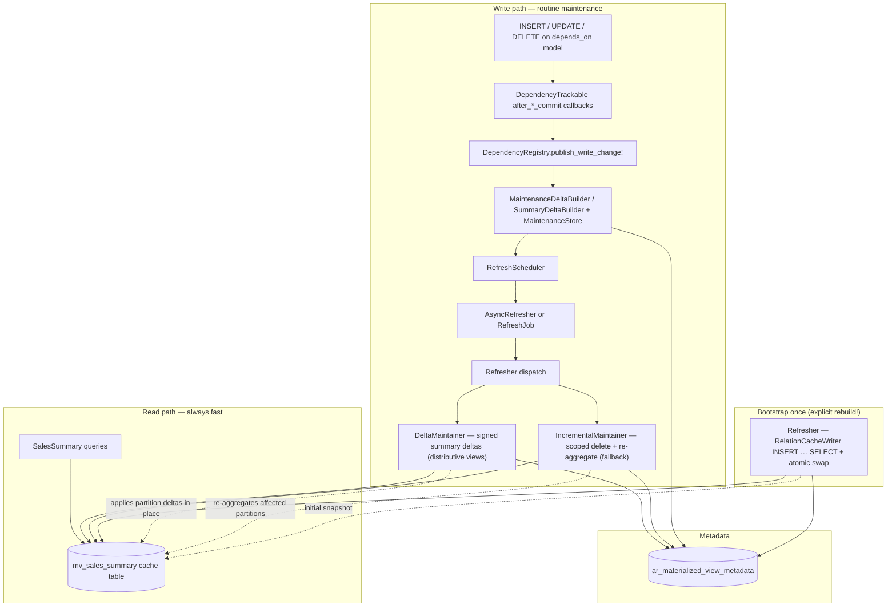

<p align="center">
  <picture>
    <source media="(prefers-color-scheme: dark)" srcset="https://raw.githubusercontent.com/mavrukin/activerecord-materialized/main/assets/png/lockup-horizontal-dark.png">
    
  </picture>
</p>

# activerecord-materialized

**Materialized views for Rails apps on databases that don't have them** — precompute an expensive query into a cache table, refresh it in the background when the underlying data changes, and read it through a transparent ActiveRecord API.

[](https://rubygems.org/gems/activerecord-materialized)
[](https://github.com/mavrukin/activerecord-materialized/actions/workflows/ci.yml)
[](https://rubydoc.info/gems/activerecord-materialized)
[](activerecord-materialized.gemspec)
[](activerecord-materialized.gemspec)
[](LICENSE)

> **Use case:** Your reporting page runs a 12-second join across six tables. Users visit once a day. MySQL has no native materialized views. This gem gives you PostgreSQL-style semantics in application code — writes trigger refresh, reads never pay for it.

### Why use this?

- **Reads stay fast** — queries hit a small precomputed table, not a multi-second join.
- **Freshness is automatic** — a write to a `depends_on` model schedules background maintenance; you don't refresh by hand.
- **Nothing blocks on a rebuild** — refresh is incremental and on-write, never on-read, and a full rebuild only ever happens when you explicitly ask for it.
- **It's just ActiveRecord** — `where`, `find`, `count`, and scopes work unchanged; an unbuilt view still returns correct results by reading through to the source.
- **It's portable** — works on MySQL, MariaDB, and SQLite, which have no native materialized views.

> 🚀 **New here? Start with the [Getting started tutorial](docs/getting-started.md)** — a hands-on, fully tested walkthrough from install to refresh-on-write.
>
> 🧪 **Want to feel it?** A runnable Rails demo lives in [`demo/`](demo/) — compare raw vs. materialized timings side by side, mutate the data, and watch the view go stale and catch up.

**Author:** [Michael Avrukin](https://github.com/mavrukin) · **License:** [MIT](LICENSE)

---

## Table of contents

- [Database compatibility](#database-compatibility)
- [Why this exists](#why-this-exists)
- [How it works](#how-it-works)
- [Research background](#research-background)
- [Features](#features)
- [Gotchas and trade-offs](#gotchas-and-trade-offs)
- [Installation](#installation)
- [Getting started tutorial](#getting-started-tutorial)
- [Quick start](#quick-start)
- [Configuration](#configuration)
- [Change sources](#change-sources)
- [Observability](#observability)
- [Detecting data drift](#detecting-data-drift)
- [Bounded staleness and self-healing](#bounded-staleness-and-self-healing)
- [API reference](#api-reference)
- [Benchmark results](#benchmark-results)
- [When to use (and when not to)](#when-to-use-and-when-not-to)
- [Comparison with native materialized views](#comparison-with-native-materialized-views)
- [Versioning](#versioning)
- [Development](#development)
- [Contributing](#contributing)

---

## Database compatibility

Integration-tested in CI on every push to `main` — real **MySQL** and **PostgreSQL** via Docker containers, **SQLite** in process. Each badge reflects that adapter's integration workflow; see [integration testing](docs/integration-testing.md) to run the matrix locally or add a database.

| Database      | CI status |
|---------------|-----------|
| MySQL 8       | [](https://github.com/mavrukin/activerecord-materialized/actions/workflows/db-mysql.yml) |
| PostgreSQL 16 | [](https://github.com/mavrukin/activerecord-materialized/actions/workflows/db-postgres.yml) |
| SQLite 3      | [](https://github.com/mavrukin/activerecord-materialized/actions/workflows/db-sqlite.yml) |

The CDC ingestion path (`ingest_change`) is exercised end-to-end against each engine — a raw write that bypasses callbacks is relayed and the view converges via scoped maintenance.

## Why this exists

Many Rails applications on **MySQL**, **MariaDB**, or **SQLite** hit the same wall:

| Symptom | Example |
|---------|---------|
| Complex joins + aggregations | `GROUP BY`, `DISTINCT`, correlated subqueries |
| Seconds per query even with indexes | Dashboards, admin reports, analytics APIs |
| Read-heavy, write-light | Thousands of reads/day, dozens of writes/day |
| No native MV support | Unlike PostgreSQL's `CREATE MATERIALIZED VIEW` |

**Materialized views** solve this by storing query results as a physical table and refreshing that snapshot when source data changes. High-end databases (PostgreSQL, Oracle, SQL Server) provide this natively. When your database cannot, **activerecord-materialized** implements the same read/refresh split in Ruby — without changing how developers query data.

### The problem with refresh-on-read

A naive approach refreshes the view on the first read after data changes. That punishes the unlucky user whose visit triggers a 10-second rebuild — and on a large database an implicit full rebuild can be catastrophic. This gem **never rebuilds implicitly**: a full materialization happens only via an explicit `rebuild!(confirm: true)`. Routine freshness is **incremental, on write** (dependency changes schedule partition-local maintenance after commit), and an unbuilt view stays correct via **read-through** to the source query until you build it.

---

## How it works

### Architecture



### Refresh lifecycle

1. **Define** a view class with a `materialized_from` block (returning an `ActiveRecord::Relation`) and `depends_on` models.
2. **Build** — an explicit `rebuild!(confirm: true)` materializes the source relation into the cache table via `RelationCacheWriter` + atomic swap. This is the only full-scan path and never fires implicitly; until it runs, reads fall through to the source (`cold_read :read_through`).
3. **Write** — any create/update/destroy on a `depends_on` model fires an `after_*_commit` callback (installed by `DependencyTrackable`) that calls `DependencyRegistry.publish_write_change!`.
4. **Accumulate** — for each affected view, `MaintenanceDeltaBuilder` records affected `GROUP BY` partition keys in `MaintenanceStore` (widens to all partitions when scope is unknown).
5. **Defer** — `after_*_commit` fires only once the writing transaction commits, so changes are batched naturally and a rolled-back transaction schedules nothing.
6. **Debounce** — rapid writes coalesce into one maintenance pass (configurable window).
7. **Maintain** — distributive views (`SUM`/`COUNT`/`COUNT(*)`) apply signed **summary deltas** straight to the affected cache rows without re-reading base rows (`DeltaMaintainer`); everything else (`AVG`, `MIN`, `MAX`, `COUNT(DISTINCT)`, joins, `HAVING`) **re-aggregates only the affected partitions** (`IncrementalMaintainer`). Neither path does DDL or an atomic swap on the hot path.
8. **Read** — once built, `where`, `find`, `count`, scopes query the cache table directly; reads before maintenance completes return the previous snapshot, reads after see updated partitions. Before the view is built, reads transparently fall through to the source query.

### Core components

| Component | Role |
|-----------|------|
| `ActiveRecord::Materialized::View` | Base model; DSL and query interface |
| `DependencyTrackable` | Installs `after_*_commit` callbacks on `depends_on` models |
| `DependencyRegistry` | Maps tables → view classes; publishes commit writes to affected views |
| `RefreshScheduler` | Dispatches `:async`, `:immediate`, or `:manual` strategies |
| `AsyncRefresher` | Debounced in-process background maintenance (tests: `flush!`) |
| `RefreshJob` | Optional ActiveJob wrapper for production workers |
| `ViewDefinition` | Inspects source relations for `GROUP BY` maintenance keys |
| `AggregateAnalysis` | Classifies a view's aggregates; decides if it is summary-delta maintainable |
| `MaintenanceDeltaBuilder` | Maps ActiveRecord change payloads to affected partition keys (scoped recompute) |
| `SummaryDeltaBuilder` / `SummaryDelta` | Compute and accumulate signed per-partition aggregate deltas (distributive views) |
| `MaintenanceStore` | Persists pending maintenance (delta or scope) in metadata |
| `DeltaMaintainer` | Hot path for distributive views: applies summary deltas in place, no base re-read |
| `IncrementalMaintainer` | Fallback hot path: partition delete + re-aggregate in the existing cache table |
| `Refresher` | Orchestrates explicit bootstrap/full refresh and dispatches incremental maintenance |
| `RelationCacheWriter` | Materializes the relation via `INSERT … SELECT`; atomic table swap on full refresh |
| `QueryExpressions` | Portable Arel helpers (`sum_as`, `count_distinct_as`, …) for view definitions |
| `Metadata` | Tracks `dirty`, `maintenance_payload`, `last_refreshed_at`, `row_count`, errors |

---

## Research background

This gem applies decades of materialized-view and incremental-maintenance research to the application layer.

### Foundational surveys

| Topic | Reference |
|-------|-----------|
| **Materialized views monograph** | Chirkova & Yang, [*Materialized Views*](https://dsf.berkeley.edu/cs286/papers/mv-fntdb2012.pdf) (Foundations and Trends in Databases, 2012) — definitions, refresh strategies, view selection, query rewriting |
| **View maintenance taxonomy** | Gupta & Mumick, [*Maintenance of Materialized Views: Problems, Techniques, and Applications*](https://homepages.inf.ed.ac.uk/wenfei/qsx/reading/gupta95maintenance.pdf) (IEEE Data Engineering Bulletin, 1995) — when full vs incremental refresh is appropriate |

### Incremental view maintenance

| Topic | Reference |
|-------|-----------|
| **Warehousing & decoupled sources** | Zhuge et al., [*View Maintenance in a Warehousing Environment*](https://sigmodrecord.org/publications/sigmodRecord/9506/pdfs/568271.223848.pdf) (SIGMOD 1995) — maintaining views when base data lives outside the warehouse |
| **Higher-order deltas** | Ahmad et al., [*DBToaster: Higher-order Delta Processing for Dynamic, Frequently Fresh Views*](https://arxiv.org/pdf/1207.0137) (VLDB 2012) — recursive finite-differencing for low-latency view refresh |
| **Factorized IVM (F-IVM)** | Nikolic & Olteanu, [*Incremental View Maintenance with Triple Lock Factorization Benefits*](https://www.cs.ox.ac.uk/dan.olteanu/papers/no-sigmod18.pdf) (SIGMOD 2018) — factorized higher-order maintenance for conjunctive queries and aggregates |
| **IVM survey (recent)** | Olteanu, [*Recent Increments in Incremental View Maintenance*](https://arxiv.org/pdf/2404.17679) (PODS 2024 Gems) — fine-grained complexity and modern IVM engines |

### Systems & dataflow approaches

| Topic | Reference |
|-------|-----------|
| **Differential dataflow** | McSherry et al., [*Differential Dataflow*](https://www.cidrdb.org/cidr2013/Papers/CIDR13_Paper111.pdf) (CIDR 2013) — incremental computation over changing data with multi-version state |
| **Application-layer precomputation** | Gjengset et al., [*Noria: dynamic, partially-stateful data-flow for high-performance web applications*](https://www.usenix.org/system/files/osdi18-gjengset.pdf) (OSDI 2018) — partially-stateful dataflow that incrementally maintains query results for web backends |

### Practical references

| Topic | Reference |
|-------|-----------|
| **Production reference** | [PostgreSQL: REFRESH MATERIALIZED VIEW](https://www.postgresql.org/docs/current/sql-refreshmaterializedview.html) — `CONCURRENTLY` refresh, separate read/refresh paths |
| **Benchmark schema** | Leis et al., [*How Good Are Query Optimizers, Really?*](https://dl.acm.org/doi/10.1145/3035918.3064035) (VLDB 2015) — [Join Order Benchmark](https://github.com/gregrahn/join-order-benchmark) used in this repo's benchmark suite |

**Design choice:** After a one-time bootstrap, routine refresh uses **incremental view maintenance (IVM)** by default. Following Gupta & Mumick, aggregate views with `GROUP BY` are maintained by recomputing only **affected partitions** (group keys) and merging them into the existing cache table — no table rebuild, no atomic swap on the hot path. Writes on `depends_on` models accumulate partition keys from ActiveRecord change payloads; maintenance deletes stale partition rows and inserts freshly aggregated replacements. Use `refresh_mode :full` when a view cannot be maintained incrementally.

---

## Features

- **Refresh on write** — dependency changes schedule background refresh; reads never block on rebuild
- **Transparent ActiveRecord API** — `where`, `find`, `count`, scopes, associations on cache tables
- **Relation-based sources** — `materialized_from` blocks return `ActiveRecord::Relation` (no raw SQL strings)
- **Portable aggregations** — `QueryExpressions` helpers build Arel for `SUM`, `COUNT`, `AVG`, etc.
- **Incremental maintenance by default** — summary-delta IVM for distributive `GROUP BY` views (signed deltas, no base re-scan) with partition-local re-aggregation as the always-correct fallback; no cache-table rebuild on routine refresh
- **Atomic table swap on bootstrap only** — initial full materialization + rename when the cache is first built or on `refresh_mode :full`
- **Debounced async refresh** — coalesce rapid writes (PostgreSQL NOTIFY + worker pattern)
- **ActiveJob integration** — offload refresh to Sidekiq, GoodJob, Solid Queue, etc.
- **Pluggable change sources** — `depends_on` models with ActiveRecord commit callbacks by default, or feed changes from a custom source (bulk loads, raw SQL, other services) through the public ingestion API — including CDC / external change streams via `ingest_change`
- **Metadata table** — `last_refreshed_at`, `dirty`, `row_count`, `refresh_duration_ms`, errors
- **Staleness safety net** — optional `max_staleness` + rake tasks for cron-driven refresh
- **Rails generators** — `activerecord_materialized:install`, `:view`, and `:migration` (cache-table migration inferred from the source relation)
- **Rake tasks** — `materialized:refresh_all`, `:refresh_stale`, `:rebuild`, `:verify`, `:warm_up`
- **Benchmark suite** — JOB-schema SQLite database with multi-second analytical queries

---

## Gotchas and trade-offs

| Gotcha | Detail |
|--------|--------|
| **Eventual consistency** | Between a write and background refresh completing, reads return the previous snapshot. Same trade-off as `REFRESH MATERIALIZED VIEW CONCURRENTLY` in PostgreSQL. |
| **`depends_on` is required** | The gem cannot infer dependencies from a relation. Declare every model (or table) whose writes should trigger refresh. Prefer model classes (`depends_on LineItem`) so commit callbacks are wired automatically. |
| **Maintenance scope** | Partition keys are taken from ActiveRecord change payloads when possible (`create`/`update`/`destroy` with equality on `GROUP BY` columns). Unbounded writes widen to all partitions (in-place, still no DDL). When the group key lives on a joined table, configure [`partition_key_for`](#views-whose-group-key-lives-on-a-joined-table) so leaf-table writes stay scoped. |
| **Non-aggregate views** | Views without `GROUP BY` fall back to full refresh (`refresh_mode :full` or atomic swap). Join-heavy maintenance (Larson & Zhou) is not automatic yet. |
| **Full refresh escape hatch** | `rebuild!(confirm: true)` (or `refresh_mode :full`) rebuilds via atomic swap — use for recovery or non-maintainable views. `refresh!` is always incremental and never rebuilds. |
| **Table-name-only `depends_on`** | Symbol/string table names work, but callback-based refresh-on-write requires a resolvable ActiveRecord model for that table. Raw SQL writes bypass callbacks — feed them through the ingestion API (see [Change sources](#change-sources)). |
| **SQLite vs MySQL in dev** | The benchmark uses SQLite. Production behavior is adapter-agnostic, but test atomic swap on your target database. |
| **Dispatcher at scale** | `refresh_dispatcher` auto-resolves to `:active_job` when ActiveJob is loaded, else the in-process `:async` thread (single-process-only; warned at boot). Multi-server deployments should confirm `:active_job` and run the periodic backstop from **one** owner — see [distributed deployment](docs/distributed-deployment.md). |
| **No automatic indexes** | Cache tables are created from query results. Add indexes on cache columns you filter/sort on. |
| **Storage** | Cache tables duplicate data. Plan disk usage accordingly. |
| **Nested transactions** | Refresh is scheduled on the transaction where the write occurred; rollback clears pending refreshes for that transaction. |
| **Bulk writes** | Each committed row to a `depends_on` model runs the maintenance bookkeeping once. Use `:async` (with a non-zero debounce, the default) or `:manual`, not `refresh_debounce 0` or `:immediate`. Pending scope that spans more than `max_tracked_partitions` distinct partitions collapses to one full recompute. `insert_all`/`upsert_all` **bypass** `after_commit`, so a callback-driven view won't be notified — call `ActiveRecord::Materialized.mark_dirty_for_tables!` after the bulk load to recompute it (see [Change sources](#change-sources)). |

---

## Installation

Add to your Gemfile:

```ruby
gem "activerecord-materialized"
```

Install the metadata migration:

```bash
bin/rails generate activerecord_materialized:install
bin/rails db:migrate
```

---

## Getting started tutorial

The **[Getting started tutorial](docs/getting-started.md)** is the recommended first read: a hands-on walkthrough that goes from `bundle install` to a view that refreshes itself on write — defining a view, reading through before it's built, building it, querying it, and watching background maintenance update it. Every example in it is executed by the test suite (`spec/docs/getting_started_tutorial_spec.rb`), so the code and the numbers are guaranteed to work.

The condensed reference version follows below.

---

## Quick start

Generate a view model:

```bash
bin/rails generate activerecord_materialized:view SalesSummary
```

Define the view:

```ruby
class SalesSummary < ActiveRecord::Materialized::View
  extend ActiveRecord::Materialized::QueryExpressions

  self.table_name = "mv_sales_summary"

  materialized_from do
    line_items = LineItem.arel_table
    orders = Order.arel_table
    products = Product.arel_table

    LineItem
      .joins(:order, :product)
      .group(products[:category])
      .select(
        products[:category],
        sum_as(line_items[:amount], as: :revenue),
        count_distinct_as(orders[:id], as: :order_count)
      )
  end

  depends_on LineItem, Order, Product
  refresh_on_change :async
  refresh_debounce 30.seconds
  max_staleness 12.hours

  before_refresh { Rails.logger.info("Refreshing #{name}") }
end
```

Sources must be `ActiveRecord::Relation` objects built with standard query APIs and Arel — not raw SQL strings. Extract complex relations to a module or class method when a view definition grows large (see `spec/support/view_sources.rb` and `benchmark/support/source_relations.rb` in this repo).

Provision the (empty) cache table with a migration generated from the relation, so it exists at deploy time:

```bash
bin/rails generate activerecord_materialized:migration SalesSummary
bin/rails db:migrate
```

Build the view once (e.g. in a deploy task) — the only full-scan path, never implicit:

```ruby
SalesSummary.rebuild!(confirm: true)
```

Then query like any ActiveRecord model:

```ruby
# Served from the mv_sales_summary cache table — never triggers a rebuild.
# (Before the view is built, this reads through to the source query instead.)
SalesSummary.where("revenue > ?", 10_000).order(revenue: :desc)
```

Refresh strategies:

| Strategy | Behavior |
|----------|----------|
| `:async` (default) | After commit, debounced, via background thread or ActiveJob |
| `:immediate` | Synchronous refresh on each write (blocks writers) |
| `:manual` | Mark dirty only; call `refresh!` or rake tasks explicitly |

### Incremental maintenance (default)

For `GROUP BY` aggregate views, no extra configuration is required. The gem:

1. Inspects the `materialized_from` relation to derive maintenance partition keys (`GROUP BY` columns).
2. Accumulates affected partition keys from dependency writes (via ActiveRecord commit callbacks).
3. On refresh, deletes and re-inserts only those partitions in the existing cache table.

Optional overrides when you need explicit control:

```ruby
class SalesSummary < ActiveRecord::Materialized::View
  incremental_keys :category # override inferred GROUP BY keys
  refresh_mode :full         # opt out of incremental maintenance
  # incremental_from { ... } # optional: override auto-scoped maintenance relation
end
```

#### Views whose group key lives on a joined table

When the `GROUP BY` key lives on a **joined/parent** table, a write to the *leaf*
dependency table can't supply it from its own change payload, so maintenance would
widen to a full recompute. `partition_key_for` maps such a write to the partition
key(s) it affects, so maintenance stays scoped:

```ruby
class PagesByCountry < ActiveRecord::Materialized::View
  materialized_from do
    Book.joins(:author).group("authors.country").select(...)
  end
  depends_on Book, Author

  # A Book write carries author_id, not country — resolve the affected partition(s).
  partition_key_for :books do |change|
    author_ids = [change.before["author_id"], change.after["author_id"]].compact.uniq
    Author.where(id: author_ids).pluck(:country)
  end
end
```

The block receives the `WriteChange` and returns the key value(s) — a scalar or an
array for a single-column key, a tuple or an array of tuples for a composite key;
returning nothing falls back to a full recompute. It trades a small indexed lookup
per write for avoiding one. Writes to the table that *does* carry the key (here,
`authors`) already scope automatically and need no resolver.

---

## Configuration

```ruby
# config/initializers/activerecord_materialized.rb
ActiveRecord::Materialized.configure do |config|
  config.default_refresh_strategy = :async
  config.default_refresh_debounce = 30.seconds
  config.refresh_dispatcher = :active_job   # :async for in-process thread
  config.refresh_queue_name = :materialized_views
  config.default_max_staleness = 12.hours
  config.default_cold_read_strategy = :read_through  # :serve_stale or :raise
  config.default_change_source = :callbacks          # :none to drive views from a custom source
  config.atomic_swap_refresh = true
  config.max_tracked_partitions = 1_000             # collapse to a full recompute past this
  config.metadata_table_name = "ar_materialized_view_metadata"

  # Writer/replica topology (see the distributed-deployment guide) — all default to off:
  config.maintenance_role = :writing   # route refresh/reconcile/rebuild to the primary
  config.verification_role = :reading  # offload DataVerifier reads to a replica
  config.replica_lag = 0               # replication-lag budget folded into staleness
end
```

---

## Change sources

A **change source** is whatever tells a view its dependency data changed. The
built-in default is ActiveRecord commit callbacks: declaring `depends_on` installs
`after_*_commit` hooks on the model, and every committed write is published to the
view. Callbacks are the right default for in-app writes, but they only observe
writes that go through ActiveRecord — bulk paths (`insert_all` / `update_all`), raw
SQL, and writes from other processes bypass them. For those, drive maintenance
through the public ingestion API from your own change source.

### The ingestion API

Two module-level entry points, callable from anywhere — a job, a rake task, an
external consumer:

```ruby
# Fine-grained: publish a specific committed write. Drives the externally-fed
# views (change_source :none) on that table; a callback-driven view is left to its
# own commit callbacks, so it is never maintained twice.
ActiveRecord::Materialized.publish_write_change!(
  ActiveRecord::Materialized::WriteChange.from_record(line_item, :create)
)

# Coarse: "something in these tables changed" — enqueues a full recompute for every
# dependent view and schedules it. Use when you cannot describe the individual
# write, or to recover a callback-driven view after a callback-skipping bulk load
# (insert_all/update_all). Idempotent, so safe to call repeatedly.
ActiveRecord::Materialized.mark_dirty_for_tables!(["line_items"])
```

### Running callback-free

To drive a view entirely from an external source, turn off automatic callback
installation — globally or per view. `depends_on` still declares the dependency
tables (used for scoping and metadata); only the commit-callback wiring is skipped.

```ruby
# Globally, in the initializer:
ActiveRecord::Materialized.configure { |c| c.default_change_source = :none }

# Or per view — declare change_source :none before depends_on (or rely on the
# global default) so no commit callbacks are installed for it:
class SalesSummary < ActiveRecord::Materialized::View
  materialized_from { ... }
  change_source :none         # fed by an external adapter
  depends_on :line_items      # still declared for scoping and metadata
end
```

(Opting back in with `change_source :callbacks` re-installs callbacks for
already-declared dependencies, so it works in either order.)

Each view is fed by exactly one source, and the engine enforces it: a committed
write reaches only the callback-driven views on the table, and a
`publish_write_change!` call reaches only the externally-fed ones. So callback-driven
and externally-fed views coexist safely — no view is maintained twice — even when
they share a dependency table.

### Writing a custom adapter

An adapter's only job is to observe changes and call the ingestion API. The engine
expects, and provides:

- **Idempotency / at-least-once** — an externally-fed view recomputes its affected
  partitions from the source (never the additive summary-delta path), so
  redelivering the same change converges instead of double-counting. At-least-once
  delivery is fine.
- **Out-of-order tolerance** — partitions are recomputed from the source, so events
  need not arrive in commit order.
- **Optional key tuples** — a `WriteChange` carrying the `GROUP BY` columns scopes
  the recompute to the affected partitions; without them it widens to a full
  recompute (always correct, just less efficient), and `mark_dirty_for_tables!` is
  the fully coarse form.

The built-in callback tracker (`DependencyTrackable`) is itself implemented on top
of `publish_write_change!` — a custom adapter is no different.

### Driving maintenance from CDC / an external change stream

Model callbacks only observe writes that go through the app's ActiveRecord layer.
The mechanism that captures *every* committed change — regardless of who wrote it
(app, raw SQL, bulk loaders, other services) — is database **Change Data Capture**:
consuming the binlog / WAL via a Debezium- or Maxwell-style pipeline. `ingest_change`
is the descriptor-oriented entry point for wiring such a stream to the engine,
without the gem depending on any specific CDC tool. Views fed this way declare
`change_source :none`.

```ruby
# A change-stream consumer relays each committed change. Normalize your stream's
# event shape to this call; nothing here is tied to a particular CDC system.
consumer.each do |event|
  ActiveRecord::Materialized.ingest_change(
    table:          event.fetch("table"),
    operation:      event.fetch("op"),   # :create / :update / :destroy
    key_attributes: event["key"],        # the GROUP BY columns of the row, if known
    before:         event["before"],     # optional pre-image  (:update / :destroy)
    after:          event["after"]       # optional post-image (:create / :update)
  )
end
```

**Delivery semantics** the engine relies on (so a real-world stream just works):

- **At-least-once is fine.** An externally-fed view recomputes its affected
  partitions, so a redelivered change converges — it never double-counts.
- **Out-of-order is tolerable.** Partitions are recomputed from the source, so
  events need not arrive in commit order.
- **Key tuples are optional.** `key_attributes` (or a full `before`/`after` image)
  scopes the recompute to the affected partitions; omit them and the change widens
  to a full recompute — always correct, just less efficient. This is the knob to
  reach for when your stream can't reliably supply the `GROUP BY` columns. A
  partition-moving `:update` needs both sides (full `before`+`after`, or
  `key_attributes`); a lone after-image can't identify the old partition, so it
  safely widens rather than under-scoping (relevant for minimal-image binlogs).

**Decoding a log-based CDC envelope.** A log-based CDC platform (Debezium / Maxwell /
Kafka Connect, reading the MySQL binlog or Postgres WAL) emits a change envelope that
maps directly onto this call: `op` `c`/`u`/`d`/`r` → `:create`/`:update`/`:destroy`
(a snapshot `r` → `:create`), the `before`/`after` row images → `before:`/`after:`, and
`source.table` → `table:`. Capturing the **old-image** partition key on an update or
delete requires **full row images** — MySQL `binlog-row-image=FULL` and Postgres
`REPLICA IDENTITY FULL` — otherwise only the primary key is logged and a
partition-moving change can't identify the old partition, so it widens to a full
recompute. This path is integration-tested by decoding a real `test_decoding` logical
slot (Postgres) and a real ROW binlog (MySQL) and asserting the view converges — so the
ingestion API is verified against what an actual CDC consumer emits, not a synthesized
descriptor (see [integration testing](docs/integration-testing.md)).

CDC composes with callbacks (use callbacks for in-app writes and CDC for the write
paths they miss) as long as each view has a single source: give CDC-fed views
`change_source :none`.

### Capturing out-of-band writes with database triggers

When you can't hook the write in code (a DBA's ad-hoc SQL, another service writing
the same table) but don't want to operate a full CDC pipeline, the built-in
**trigger/outbox adapter** captures *every* write to a table database-side and relays
it into scoped maintenance — no external infrastructure:

```bash
bin/rails generate activerecord_materialized:outbox line_items category region
bin/rails db:migrate   # installs AFTER INSERT/UPDATE/DELETE triggers (adapter-correct DDL)
```

```ruby
# Relay captured writes on a schedule (cron / recurring job / poller).
ActiveRecord::Materialized.drain_write_outbox!
```

Triggers append the changed `GROUP BY` keys to an outbox table; `drain_write_outbox!`
relays them through `ingest_change`, so an out-of-band write maintains exactly the
partitions it touched. The triggers fire on *every* write to the table, so the fed view
is `change_source :none` (a single source — not mixed with callbacks). See
**[detecting out-of-band writes](docs/out-of-band-writes.md)**
for the full layered defense (callbacks → ingestion API → triggers → CDC →
reconciliation) and when to choose each.

---

## Observability

The gem instruments its read, refresh, and maintenance lifecycle points with
[`ActiveSupport::Notifications`](https://api.rubyonrails.org/classes/ActiveSupport/Notifications.html)
events. The event names and payload keys below are a stable contract — subscribe
to wire freshness and behavior SLIs to any APM / StatsD / OpenTelemetry backend
without the gem taking a dependency on a specific telemetry vendor.

| Event | When | Payload |
|-------|------|---------|
| `read.active_record_materialized` | Once per routed read (`where`, `find`, `count`, …) | `:view`, `:source` (`:cache`, `:read_through`, `:serve_stale`, `:raise`), `:staleness` (seconds since last refresh, or `nil`) |
| `refresh.active_record_materialized` | Once per `refresh!` / `rebuild!`, timed | `:view`, `:operation` (`:incremental`/`:rebuild`), `:mode` (`:summary_delta`/`:scoped_recompute`/`:full`), `:partition_count` (partitions recomputed, `nil` for a full pass), `:row_count`, `:skipped`, and on failure the standard `:exception`/`:exception_object` |
| `maintenance.active_record_materialized` | Once per dependency write that records pending maintenance | `:view`, `:table`, `:operation` (`:create`/`:update`/`:destroy`), `:path` (`:summary_delta`/`:scoped_recompute`), `:scope` (`:scoped`, or `:full` when the write **widened to a full recompute**), `:partition_count` (distinct partitions scoped, `0` on a widen) |
| `reconcile.active_record_materialized` | Once per `reconcile!` / `reconcile_stale!` run per view | `:view`, `:mode` (drift-check depth), `:repaired_partition_count` (partitions repaired with scoped maintenance), `:deferred` (`true` when a concurrent refresh deferred the run to the next tick) |

A read served with `source: :read_through` means the view was cold and the query
fell through to the source. A maintenance event with `scope: :full` means the
write's partition key could not be derived and maintenance widened to a full
recompute — a high widen rate is the signal to scope it (see the join-keyed
resolver) or to investigate a missing change source.

### Example subscriber

```ruby
# config/initializers/materialized_metrics.rb
ActiveSupport::Notifications.subscribe("read.active_record_materialized") do |event|
  payload = event.payload
  StatsD.increment("mv.read", tags: ["view:#{payload[:view]}", "source:#{payload[:source]}"])
  StatsD.gauge("mv.read.staleness", payload[:staleness], tags: ["view:#{payload[:view]}"]) if payload[:staleness]
end

ActiveSupport::Notifications.subscribe("refresh.active_record_materialized") do |event|
  payload = event.payload
  StatsD.distribution("mv.refresh.duration", event.duration, tags: ["view:#{payload[:view]}", "mode:#{payload[:mode]}"])
  StatsD.increment("mv.refresh.error", tags: ["view:#{payload[:view]}"]) if payload[:exception]
end

ActiveSupport::Notifications.subscribe("maintenance.active_record_materialized") do |event|
  payload = event.payload
  StatsD.increment("mv.maintenance.widen", tags: ["view:#{payload[:view]}"]) if payload[:scope] == :full
end
```

The constants `ActiveRecord::Materialized::Instrumentation::READ`, `REFRESH`,
`MAINTENANCE`, and `RECONCILE` hold the event-name strings if you prefer referencing
them over string literals. Read events are emitted only while a subscriber is attached, so
there is no staleness-lookup cost on the read path when nobody is listening.

---

## Detecting data drift

`materialized:verify` checks a cache table's **schema** against its source. To
detect **data** drift — the materialized contents diverging from what the source
relation would produce now (e.g. because a write slipped past the change source) —
use the data-verification API. It recomputes the source and compares it to the
cache per partition, reporting the divergent partition keys. It never alters data.
Both the cache and the recomputed source are read through the **cache model's own
column types**, so a value that reads back through two different type systems (a
date key, an integer/decimal column, a computed source aggregate) isn't mistaken
for drift; duplicate cache rows for a partition are caught rather than collapsed. It
covers grouped/aggregate views — a non-grouped view, a schema-drifted cache, or one
whose `GROUP BY` key can't be matched to a projected column is skipped. (An
un-scaled decimal aggregate can still differ in trailing float precision; give such
a column an explicit scale to compare it soundly.)

```ruby
# One view, programmatically — returns a DataVerificationResult.
result = ActiveRecord::Materialized::DataVerifier.new(SalesSummary, mode: :checksum).verify
result.drifted?        # => true/false
result.mismatched_keys # => partitions whose values differ
result.missing_keys    # => in the source, absent from the cache
result.extra_keys      # => in the cache, absent from the source

# All registered views — array of results, or verify_data! to raise on drift.
ActiveRecord::Materialized.verify_data(mode: :checksum)
ActiveRecord::Materialized.verify_data!(mode: :full)   # boot/CI/cron gate; raises DataDriftError
```

Modes trade cost for depth:

| Mode | Compares | Use when |
|------|----------|----------|
| `:row_count` | Which partitions exist, and each partition's row count (missing/extra partitions, plus duplicated/lost rows via `mismatched_keys`) | Cheapest structural check |
| `:checksum` | A per-partition digest of the value columns | Wide rows; detect value drift compactly |
| `:full` | The value columns exactly | Exhaustive / debuggable |

For large views, `sample:` (an Integer count or a Float fraction) is a cheap
periodic probe: it value-checks a random subset of **materialized** partitions and
reports coverage (`checked_partition_count` / `total_partition_count`). Because it
only looks at partitions already in the cache, it detects value drift and extra
partitions but **not missing (source-only) partitions** — use full mode (or a
sample covering every partition, which runs exhaustively) for completeness. The
returned partition keys are what a repair step re-maintains (see self-healing
reconciliation).

Rake: `bin/rails materialized:audit` runs `verify_data!` across all views.

---

## Bounded staleness and self-healing

Any change source can miss a write — callbacks miss bulk/raw writes, and even a CDC
stream can drop or lag. Left alone, a missed write leaves a partition wrong
indefinitely. **Reconciliation** turns that unbounded drift into bounded,
self-correcting staleness: on a schedule it verifies each view (via [data-drift
detection](#detecting-data-drift)) and repairs whatever diverged — re-aggregating
missing/mismatched partitions and dropping extra ones — using **scoped** maintenance,
never a full `rebuild!`.

```ruby
# One view: drain pending maintenance, verify, and repair any drift. Returns a ReconcileResult.
result = SalesSummary.reconcile!(mode: :checksum)
result.repaired?                # => true when drift was found and repaired
result.repaired_partition_count # => how many partitions were repaired

# All registered views, or only the stale ones (the scheduled backstop).
ActiveRecord::Materialized.reconcile!(mode: :checksum)         # every view
ActiveRecord::Materialized.reconcile_stale!(mode: :checksum)   # dirty / past max_staleness only
```

Run `materialized:reconcile` (which calls `reconcile_stale!`) periodically from cron
or ActiveJob. It reconciles only **stale** views — dirty, never refreshed, or past
their [`max_staleness`](#dsl) — so the window between a missed write and its repair is
bounded by your schedule interval and each view's `max_staleness`, at the cost of one
drift check per stale view per tick. Use `sample:` (see [data drift](#detecting-data-drift))
to bound that cost on large views.

Reconciliation is safe to run alongside normal refresh. It drains pending maintenance
first (so it repairs genuinely-missed writes, not maintenance merely not yet applied),
and repairs through the same guarded, transactional maintenance path — so an
overlapping refresh can neither corrupt the cache nor double-maintain. When a refresh
already holds the view's cycle, the scoped repair is **deferred**
(`ReconcileResult#deferred`): it is durably queued and drained by that cycle or the
next tick, never lost. A full `rebuild!` remains the explicit escape hatch, and
`cold_read :read_through` stays the always-correct fallback while a partition is being
repaired.

A clean reconcile resets the staleness clock (`last_reconciled_at`), so a drift-free
view is not re-verified every tick. In a batch run, a failure reconciling one view is
isolated on its `ReconcileResult#error` rather than aborting the rest of the fleet.
Each run stamps `last_reconciled_at` / `reconciled_partition_count` on the view's
metadata and emits a [`reconcile.active_record_materialized`](#observability) event.

---

## API reference

### Class methods

| Method | Description |
|--------|-------------|
| `rebuild!(confirm: true)` | **Explicit** full materialization via in-database `INSERT … SELECT` (the only full-scan path; never fires implicitly, never buffers rows in Ruby) |
| `warm_up!` | Materialize the configured `warm_up` partitions ahead of traffic |
| `refresh!` | Incremental maintenance only (no-op on an unbuilt view); never rebuilds |
| `refresh_if_stale!` | Incremental maintenance when materialized and stale |
| `reconcile!(mode:, sample:)` | Verify contents against the source and repair drift with scoped maintenance (never a rebuild); see [self-healing](#bounded-staleness-and-self-healing) |
| `materialized?` | Whether the view has been built (warm) and reads serve from the cache |
| `dirty?` | Whether a dependency change is pending maintenance |
| `stale?` | Whether view is dirty or exceeds `max_staleness` |
| `last_refreshed_at` | Timestamp of last successful refresh |
| `refreshing?` | Whether a refresh is in progress |
| `resolved_source` | The current `ActiveRecord::Relation` used for refresh |

### DSL

| Macro | Description |
|-------|-------------|
| `materialized_from { relation }` | Block returning the source `ActiveRecord::Relation` |
| `depends_on(*models_or_tables)` | Register dependencies; writes trigger refresh |
| `refresh_on_change(strategy)` | `:async`, `:immediate`, or `:manual` |
| `refresh_debounce(duration)` | Coalesce rapid writes before refreshing |
| `refresh_mode(mode)` | `:incremental` (default) or `:full` |
| `cold_read(strategy)` | Read behavior before the view is built: `:read_through` (default), `:serve_stale`, or `:raise` |
| `change_source(source)` | Where this view's changes come from: `:callbacks` (default) or `:none` (fed via the ingestion API — see [Change sources](#change-sources)) |
| `warm_up { [relations] }` | Representative queries whose partitions `warm_up!` materializes ahead of traffic |
| `incremental_from { relation }` | Optional override for scoped maintenance relation |
| `incremental_keys(*columns)` | Optional override for inferred `GROUP BY` keys |
| `partition_key_for(table) { \|change\| ... }` | Resolve a write on a joined/leaf `table` to the affected partition key(s), so maintenance scopes instead of widening |
| `max_staleness(duration)` | Optional time-based safety refresh via rake/cron |
| `before_refresh` / `after_refresh` | Refresh lifecycle callbacks |

### QueryExpressions

Include or extend `ActiveRecord::Materialized::QueryExpressions` when defining aggregations:

| Helper | Arel equivalent |
|--------|-----------------|
| `sum_as(attr, as: :name)` | `SUM(...)` |
| `avg_as(attr, as: :name)` | `AVG(...)` |
| `count_as(attr, as: :name)` | `COUNT(...)` |
| `count_distinct_as(attr, as: :name)` | `COUNT(DISTINCT ...)` |
| `count_all_as(as: :name)` | `COUNT(*)` |
| `min_as` / `max_as` | `MIN` / `MAX` |

### Rake tasks

```bash
bin/rails materialized:refresh_all     # incremental maintenance pass
bin/rails materialized:refresh_stale
bin/rails materialized:rebuild         # intentional full materialization (in-DB INSERT … SELECT)
bin/rails materialized:verify          # raise on cache-table schema drift
bin/rails materialized:audit           # raise on data drift (contents vs. source)
bin/rails materialized:reconcile       # verify stale views and repair drift (scoped); for cron/ActiveJob
bin/rails materialized:enqueue_refreshes    # fan out: one RefreshJob per stale view (run from one owner)
bin/rails materialized:enqueue_reconciles   # fan out: one ReconcileJob per stale view (run from one owner)
bin/rails materialized:warm_up         # materialize configured warm_up partitions
```

For hundreds of app servers, use the `enqueue_*` fan-out tasks from a single scheduled owner instead of running `reconcile`/`refresh_stale` as cron on every box — see [distributed deployment](docs/distributed-deployment.md).

---

## Benchmark results

The included benchmark uses a [Join Order Benchmark](https://github.com/gregrahn/join-order-benchmark)-style schema on SQLite. On the **xlarge** dataset (~2M `cast_info` rows):

| Query | Source relation | MV read | Speedup |
|-------|-----------------|---------|---------|
| `gender_pairing_stats` | ~7.4s | ~0.3ms | ~21,000× |
| `company_movie_cross` | ~7.4s | ~0.4ms | ~20,000× |
| `person_movie_network` | ~13.3s | ~0.7ms | ~20,000× |
| `cast_coappearance` | ~19.7s | ~0.4ms | ~49,000× |

Run locally:

```bash
bundle install
JOB_SCALE=xlarge bundle exec rake benchmark:setup   # ~few minutes
bundle exec rake benchmark:slow
bundle exec rake benchmark:verify_updates           # refresh-on-write proof
```

See [benchmark/DATA.md](benchmark/DATA.md) for dataset scales and setup details.

---

## When to use (and when not to)

**Good fit:**

- Expensive read-mostly reporting queries on MySQL/MariaDB/SQLite
- Dashboards and admin pages where sub-second reads matter
- Infrequent or batched writes to underlying tables
- Acceptable eventual consistency between write and background refresh

**Poor fit:**

- Real-time, strongly consistent reads (use live queries or replicas)
- Very frequent writes where full refresh cost exceeds query cost
- Tiny queries where materialization overhead isn't worth it
- Views where you cannot enumerate all `depends_on` tables

---

## Comparison with native materialized views

| Capability | PostgreSQL native | activerecord-materialized |
|------------|-------------------|---------------------------|
| Precomputed snapshot | ✅ | ✅ |
| Transparent reads | ✅ (query rewrite or direct) | ✅ (ActiveRecord model) |
| Refresh on dependency change | Manual / trigger / pg_cron | ✅ automatic via `depends_on` |
| Background refresh | `REFRESH ... CONCURRENTLY` | ✅ async / ActiveJob |
| Incremental refresh | Limited (IVM extensions) | ✅ default partition-local IVM for `GROUP BY` views |
| Atomic swap during refresh | ✅ CONCURRENTLY | ✅ table rename |
| Database portability | PostgreSQL only | ✅ any ActiveRecord adapter |

---

## Versioning

This gem follows [Semantic Versioning](https://semver.org/). Given `MAJOR.MINOR.PATCH`:

- **MAJOR** — incompatible public-API changes (DSL macros, configuration keys, the `View` query surface).
- **MINOR** — backward-compatible features.
- **PATCH** — backward-compatible bug fixes.

Until `1.0.0`, the API may still change between minor releases; pin a version if you depend on it. Every change is recorded in [CHANGELOG.md](CHANGELOG.md).

---

## Development

```bash
git clone https://github.com/mavrukin/activerecord-materialized.git
cd activerecord-materialized
bin/setup            # bundle install + git hooks
bin/ci               # RuboCop and the full test suite
bundle exec rake benchmark:setup
bundle exec rake benchmark
```

**API documentation** is published at [rubydoc.info/gems/activerecord-materialized](https://rubydoc.info/gems/activerecord-materialized) (generated from YARD doc comments, with `@param`/`@return` types authored directly on the public API). Build it locally with:

```bash
bundle exec yard doc      # generates HTML into doc/
bundle exec yard server   # browse at http://localhost:8808
```

Maintainers: see [RELEASING.md](RELEASING.md) for the gem publishing process.

---

## Contributing

Bug reports and pull requests are welcome at [github.com/mavrukin/activerecord-materialized](https://github.com/mavrukin/activerecord-materialized).

---

## License

MIT © [Michael Avrukin](https://github.com/mavrukin)
