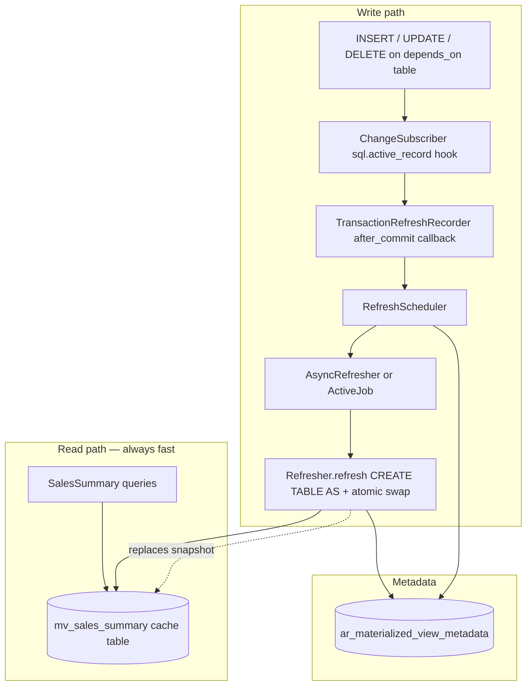

# activerecord-materialized

**Application-level materialized views for Rails and ActiveRecord** — precompute expensive analytical queries into cache tables, refresh them in the background when underlying data changes, and serve reads through a transparent ActiveRecord API.

> **Use case:** Your reporting page runs a 12-second join across six tables. Users visit once a day. MySQL has no native materialized views. This gem gives you PostgreSQL-style semantics in application code — writes trigger refresh, reads never pay for it.

[](activerecord-materialized.gemspec)
[](activerecord-materialized.gemspec)
[](LICENSE)

**Author:** [Michael Avrukin](https://github.com/mavrukin) · **License:** [MIT](LICENSE)

---

## Table of contents

- [Why this exists](#why-this-exists)
- [How it works](#how-it-works)
- [Research background](#research-background)
- [Features](#features)
- [Gotchas and trade-offs](#gotchas-and-trade-offs)
- [Installation](#installation)
- [Quick start](#quick-start)
- [Configuration](#configuration)
- [API reference](#api-reference)
- [Benchmark results](#benchmark-results)
- [When to use (and when not to)](#when-to-use-and-when-not-to)
- [Comparison with native materialized views](#comparison-with-native-materialized-views)
- [Development](#development)
- [Contributing](#contributing)

---

## Why this exists

Many Rails applications on **MySQL**, **MariaDB**, or **SQLite** hit the same wall:

| Symptom | Example |
|---------|---------|
| Complex joins + aggregations | `GROUP BY`, `DISTINCT`, correlated subqueries |
| Seconds per query even with indexes | Dashboards, admin reports, analytics APIs |
| Read-heavy, write-light | Thousands of reads/day, dozens of writes/day |
| No native MV support | Unlike PostgreSQL's `CREATE MATERIALIZED VIEW` |

**Materialized views** solve this by storing query results as a physical table and refreshing that snapshot when source data changes. High-end databases (PostgreSQL, Oracle, SQL Server) provide this natively. When your database cannot, **activerecord-materialized** implements the same read/refresh split in Ruby — without changing how developers query data.

### The problem with refresh-on-read

A naive approach refreshes the view on the first read after data changes. That punishes the unlucky user whose visit triggers a 10-second rebuild. This gem uses **refresh-on-write**: dependency changes schedule a background rebuild after commit; reads always hit the pre-built cache.

---

## How it works

### Architecture



### Refresh lifecycle

1. **Define** a view class with `materialized_from` SQL and `depends_on` tables.
2. **Bootstrap** — first read (or explicit `refresh!`) builds the cache table if missing.
3. **Write** — any INSERT/UPDATE/DELETE on a dependency table is detected via ActiveRecord SQL instrumentation.
4. **Defer** — changes inside a transaction are batched; refresh is scheduled on `after_commit`.
5. **Debounce** — rapid writes coalesce into one refresh (configurable window).
6. **Rebuild** — `Refresher` runs `CREATE TABLE ... AS <source query>`, then atomically swaps table names so reads never block on an empty table.
7. **Read** — `where`, `find`, `count`, scopes all query the cache table directly (~sub-millisecond on typical hardware).

### Core components

| Component | Role |
|-----------|------|
| `ActiveRecord::Materialized::View` | Base model; DSL and query interface |
| `ChangeSubscriber` | Listens to `sql.active_record`; detects writes on dependency tables |
| `DependencyRegistry` | Maps tables → view classes |
| `TransactionRefreshRecorder` | Registers `after_commit` / `after_rollback` on the current transaction |
| `RefreshScheduler` | Dispatches `:async`, `:immediate`, or `:manual` strategies |
| `AsyncRefresher` | Debounced in-process background refresh (tests: `flush!`) |
| `RefreshJob` | Optional ActiveJob wrapper for production workers |
| `Refresher` | Executes source SQL and performs atomic table swap |
| `Metadata` | Tracks `dirty`, `last_refreshed_at`, `row_count`, errors |

---

## Research background

This gem applies decades of materialized view research to the application layer:

| Topic | Reference |
|-------|-----------|
| **Foundational survey** | Chirkova & Yang, [*Materialized Views*](https://www.cs.duke.edu/~chirkova/materialized_views.pdf) (2000) — definitions, refresh strategies, query rewriting |
| **View maintenance** | Gupta & Mumick, [*Maintenance of Materialized Views*](https://www.cs.duke.edu/~chirkova/maint_materialized_views.pdf) — when full vs incremental refresh is appropriate |
| **Incremental maintenance** | Niehues et al., [*Incremental View Maintenance for Fresh Databases*](https://db.in.tum.de/~schuele/data/ivm-sigmod2019.pdf) (SIGMOD 2019) — statement-level delta processing; this gem applies partition-local maintenance at the application layer |
| **Precomputation** | Larson & Zhou, *Efficient Maintenance of Materialized Outer-Join Views* — trade-offs in maintaining join-heavy views |
| **Production reference** | [PostgreSQL: REFRESH MATERIALIZED VIEW](https://www.postgresql.org/docs/current/sql-refreshmaterializedview.html) — CONCURRENTLY refresh, separate read/refresh paths |
| **Benchmark schema** | Leis et al., [*How Good Are Query Optimizers, Really?*](https://dl.acm.org/doi/10.1145/3035918.3064035) (VLDB 2015) — [Join Order Benchmark](https://github.com/gregrahn/join-order-benchmark) used in this repo's benchmark suite |

**Design choice:** After a one-time bootstrap (`CREATE TABLE AS`), routine refresh uses **incremental view maintenance (IVM)** by default. Following Gupta & Mumick, aggregate views with `GROUP BY` are maintained by recomputing only **affected partitions** (group keys) and merging them into the existing cache table — no table rebuild, no atomic swap on the hot path. Writes on `depends_on` tables accumulate partition keys from SQL change events; maintenance deletes stale partition rows and inserts freshly aggregated replacements. Use `refresh_mode :full` when a view cannot be maintained incrementally.

---

## Features

- **Refresh on write** — dependency changes schedule background refresh; reads never block on rebuild
- **Transparent ActiveRecord API** — `where`, `find`, `count`, scopes, associations on cache tables
- **Declarative source SQL** — `materialized_from` with string or callable
- **Incremental maintenance by default** — partition-local re-aggregation for `GROUP BY` views; no cache-table rebuild on routine refresh
- **Atomic table swap on bootstrap only** — initial `CREATE TABLE AS` + rename when the cache is first materialized
- **Debounced async refresh** — coalesce rapid writes (PostgreSQL NOTIFY + worker pattern)
- **ActiveJob integration** — offload refresh to Sidekiq, GoodJob, Solid Queue, etc.
- **Dependency tracking** — `depends_on` tables; detects both AR and raw SQL writes
- **Metadata table** — `last_refreshed_at`, `dirty`, `row_count`, `refresh_duration_ms`, errors
- **Staleness safety net** — optional `max_staleness` + rake tasks for cron-driven refresh
- **Rails generators** — `activerecord_materialized:install`, `activerecord_materialized:view`
- **Rake tasks** — `materialized:refresh_all`, `materialized:refresh_stale`
- **Benchmark suite** — JOB-schema SQLite database with multi-second analytical queries

---

## Gotchas and trade-offs

| Gotcha | Detail |
|--------|--------|
| **Eventual consistency** | Between a write and background refresh completing, reads return the previous snapshot. Same trade-off as `REFRESH MATERIALIZED VIEW CONCURRENTLY` in PostgreSQL. |
| **`depends_on` is required** | The gem cannot infer dependencies from SQL. You must declare every base table that affects the view. Missing a table means stale reads with no refresh triggered. |
| **Maintenance scope** | Partition keys are inferred from write SQL when possible (`INSERT`/`UPDATE`/`DELETE` with equality on `GROUP BY` columns). Unbounded writes widen to all partitions (in-place, still no DDL). |
| **Non-aggregate views** | Views without `GROUP BY` fall back to full refresh (`refresh_mode :full` or atomic swap). Join-heavy maintenance (Larson & Zhou) is not automatic yet. |
| **Full refresh escape hatch** | `refresh_mode :full` or `refresh!(force: true)` rebuilds via atomic swap — use for recovery or non-maintainable views. |
| **Raw SQL table names** | `ChangeSubscriber` parses `INSERT INTO`, `UPDATE`, `DELETE FROM` statements. Unusual SQL (CTEs wrapping writes, multi-table deletes) may not be detected. |
| **SQLite vs MySQL in dev** | The benchmark uses SQLite. Production behavior is adapter-agnostic, but test atomic swap on your target database. |
| **In-process async default** | Default `refresh_dispatcher: :async` uses a background thread. **Use ActiveJob in production** so refresh work runs on job workers, not Puma threads. |
| **No automatic indexes** | Cache tables are created from query results. Add indexes on cache columns you filter/sort on. |
| **Storage** | Cache tables duplicate data. Plan disk usage accordingly. |
| **Nested transactions** | Refresh is scheduled on the transaction where the write occurred; rollback clears pending refreshes for that transaction. |

---

## Installation

Add to your Gemfile:

```ruby
gem "activerecord-materialized"
```

Install the metadata migration:

```bash
bin/rails generate activerecord_materialized:install
bin/rails db:migrate
```

---

## Quick start

Generate a view model:

```bash
bin/rails generate activerecord_materialized:view SalesSummary
```

Define the view:

```ruby
class SalesSummary < ActiveRecord::Materialized::View
  self.table_name = "mv_sales_summary"

  materialized_from <<~SQL
    SELECT
      products.category,
      SUM(line_items.amount) AS revenue,
      COUNT(DISTINCT orders.id) AS order_count
    FROM line_items
    INNER JOIN orders ON orders.id = line_items.order_id
    INNER JOIN products ON products.id = line_items.product_id
    GROUP BY products.category
  SQL

  depends_on :line_items, :orders, :products
  refresh_on_change :async
  refresh_debounce 30.seconds
  max_staleness 12.hours

  before_refresh { Rails.logger.info("Refreshing #{name}") }
end
```

Query like any ActiveRecord model:

```ruby
# Always hits mv_sales_summary cache table — never triggers refresh
SalesSummary.where("revenue > ?", 10_000).order(revenue: :desc)
```

Refresh strategies:

| Strategy | Behavior |
|----------|----------|
| `:async` (default) | After commit, debounced, via background thread or ActiveJob |
| `:immediate` | Synchronous refresh on each write (blocks writers) |
| `:manual` | Mark dirty only; call `refresh!` or rake tasks explicitly |

### Incremental maintenance (default)

For `GROUP BY` aggregate views, no extra configuration is required. The gem:

1. Parses `materialized_from` to derive maintenance partition keys (`GROUP BY` columns).
2. Accumulates affected partition keys from dependency writes (via `sql.active_record` instrumentation).
3. On refresh, deletes and re-inserts only those partitions in the existing cache table.

Optional overrides when you need explicit control:

```ruby
class SalesSummary < ActiveRecord::Materialized::View
  # ...
  incremental_keys :category          # override inferred GROUP BY keys
  incremental_from -> { ... }           # override auto-generated scoped SQL
  refresh_mode :full                  # opt out of incremental maintenance
end
```

---

## Configuration

```ruby
# config/initializers/activerecord_materialized.rb
ActiveRecord::Materialized.configure do |config|
  config.default_refresh_strategy = :async
  config.default_refresh_debounce = 30.seconds
  config.refresh_dispatcher = :active_job   # :async for in-process thread
  config.refresh_queue_name = :materialized_views
  config.default_max_staleness = 12.hours
  config.atomic_swap_refresh = true
  config.metadata_table_name = "ar_materialized_view_metadata"
end
```

---

## API reference

### Class methods

| Method | Description |
|--------|-------------|
| `refresh!` | Rebuild cache table from source SQL |
| `refresh_if_stale!` | Refresh when dirty, missing, or time-stale |
| `dirty?` | Whether a dependency change is pending refresh |
| `stale?` | Whether view is dirty or exceeds `max_staleness` |
| `last_refreshed_at` | Timestamp of last successful refresh |
| `refreshing?` | Whether a refresh is in progress |

### DSL

| Macro | Description |
|-------|-------------|
| `materialized_from(sql, &block)` | Source query used during refresh |
| `depends_on(*tables)` | Register dependency tables; writes trigger refresh |
| `refresh_on_change(strategy)` | `:async`, `:immediate`, or `:manual` |
| `refresh_debounce(duration)` | Coalesce rapid writes before refreshing |
| `refresh_mode(mode)` | `:incremental` (default) or `:full` |
| `incremental_from(sql, &block)` | Optional override for scoped maintenance SQL |
| `incremental_keys(*columns)` | Optional override for inferred `GROUP BY` keys |
| `max_staleness(duration)` | Optional time-based safety refresh via rake/cron |
| `before_refresh` / `after_refresh` | Refresh lifecycle callbacks |

### Rake tasks

```bash
bin/rails materialized:refresh_all
bin/rails materialized:refresh_stale
```

---

## Benchmark results

The included benchmark uses a [Join Order Benchmark](https://github.com/gregrahn/join-order-benchmark)-style schema on SQLite. On the **xlarge** dataset (~2M `cast_info` rows):

| Query | Raw SQL | MV read | Speedup |
|-------|---------|---------|---------|
| `gender_pairing_stats` | ~7.4s | ~0.3ms | ~21,000× |
| `company_movie_cross` | ~7.4s | ~0.4ms | ~20,000× |
| `person_movie_network` | ~13.3s | ~0.7ms | ~20,000× |
| `cast_coappearance` | ~19.7s | ~0.4ms | ~49,000× |

Run locally:

```bash
bundle install
JOB_SCALE=xlarge bundle exec rake benchmark:setup   # ~few minutes
bundle exec rake benchmark:slow
bundle exec rake benchmark:verify_updates           # refresh-on-write proof
```

See [benchmark/DATA.md](benchmark/DATA.md) for dataset scales and setup details.

---

## When to use (and when not to)

**Good fit:**

- Expensive read-mostly reporting queries on MySQL/MariaDB/SQLite
- Dashboards and admin pages where sub-second reads matter
- Infrequent or batched writes to underlying tables
- Acceptable eventual consistency between write and background refresh

**Poor fit:**

- Real-time, strongly consistent reads (use live queries or replicas)
- Very frequent writes where full refresh cost exceeds query cost
- Tiny queries where materialization overhead isn't worth it
- Views where you cannot enumerate all `depends_on` tables

---

## Comparison with native materialized views

| Capability | PostgreSQL native | activerecord-materialized |
|------------|-------------------|---------------------------|
| Precomputed snapshot | ✅ | ✅ |
| Transparent reads | ✅ (query rewrite or direct) | ✅ (ActiveRecord model) |
| Refresh on dependency change | Manual / trigger / pg_cron | ✅ automatic via `depends_on` |
| Background refresh | `REFRESH ... CONCURRENTLY` | ✅ async / ActiveJob |
| Incremental refresh | Limited (IVM extensions) | ✅ default partition-local IVM for `GROUP BY` views |
| Atomic swap during refresh | ✅ CONCURRENTLY | ✅ table rename |
| Database portability | PostgreSQL only | ✅ any ActiveRecord adapter |

---

## Development

```bash
git clone https://github.com/mavrukin/activerecord-materialized.git
cd activerecord-materialized
bundle install
bundle exec rspec
bundle exec rake benchmark:setup
bundle exec rake benchmark
```

---

## Contributing

Bug reports and pull requests are welcome at [github.com/mavrukin/activerecord-materialized](https://github.com/mavrukin/activerecord-materialized).

---

## License

MIT © [Michael Avrukin](https://github.com/mavrukin)
