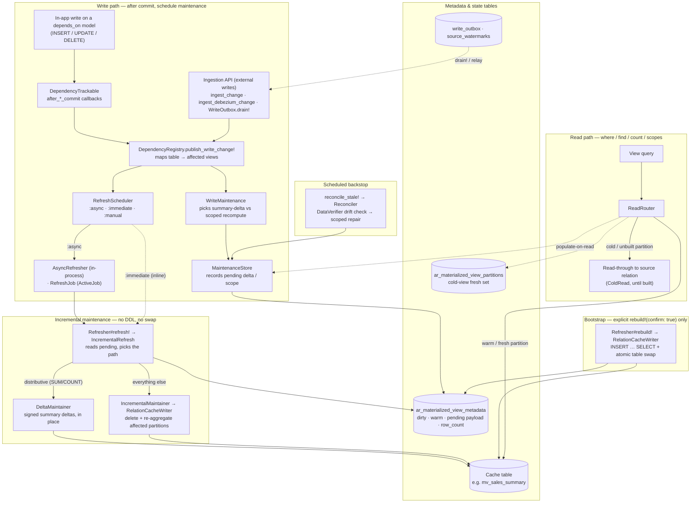

# Architecture

This is the deep architecture reference for the gem: how the write and read paths are split, the refresh lifecycle, the catalog of core components, and how scoped incremental maintenance keeps refreshes cheap.

## Architecture diagram



### Refresh lifecycle

1. **Define** a view class with a `materialized_from` block (returning an `ActiveRecord::Relation`) and `depends_on` models.
2. **Build** — an explicit `rebuild!(confirm: true)` materializes the source relation into the cache table via `RelationCacheWriter` + atomic swap. This is the only full-scan path and never fires implicitly; until it runs, reads fall through to the source (`cold_read :read_through`).
3. **Write** — any create/update/destroy on a `depends_on` model fires an `after_*_commit` callback (installed by `DependencyTrackable`) that calls `DependencyRegistry.publish_write_change!`.
4. **Accumulate** — for each affected view, `MaintenanceDeltaBuilder` records affected `GROUP BY` partition keys in `MaintenanceStore` (widens to all partitions when scope is unknown).
5. **Defer** — `after_*_commit` fires only once the writing transaction commits, so changes are batched naturally and a rolled-back transaction schedules nothing.
6. **Debounce** — rapid writes coalesce into one maintenance pass (configurable window).
7. **Maintain** — distributive views (`SUM`/`COUNT`/`COUNT(*)`) apply signed **summary deltas** straight to the affected cache rows without re-reading base rows (`DeltaMaintainer`); everything else (`AVG`, `MIN`, `MAX`, `COUNT(DISTINCT)`, joins, `HAVING`) **re-aggregates only the affected partitions** (`IncrementalMaintainer`). Neither path does DDL or an atomic swap on the hot path.
8. **Read** — once built, `where`, `find`, `count`, scopes query the cache table directly; reads before maintenance completes return the previous snapshot, reads after see updated partitions. Before the view is built, reads transparently fall through to the source query.

### Core components

| Component | Role |
|-----------|------|
| `ActiveRecord::Materialized::View` | Base model; DSL and query interface |
| `DependencyTrackable` | Installs `after_*_commit` callbacks on `depends_on` models |
| `DependencyRegistry` | Maps tables → view classes; publishes commit writes to affected views |
| `RefreshScheduler` | Dispatches `:async`, `:immediate`, or `:manual` strategies |
| `AsyncRefresher` | Debounced in-process background maintenance (tests: `flush!`) |
| `RefreshJob` | Optional ActiveJob wrapper for production workers |
| `ViewDefinition` | Inspects source relations for `GROUP BY` maintenance keys |
| `AggregateAnalysis` | Classifies a view's aggregates; decides if it is summary-delta maintainable |
| `MaintenanceDeltaBuilder` | Maps ActiveRecord change payloads to affected partition keys (scoped recompute) |
| `SummaryDeltaBuilder` / `SummaryDelta` | Compute and accumulate signed per-partition aggregate deltas (distributive views) |
| `MaintenanceStore` | Persists pending maintenance (delta or scope) in metadata |
| `DeltaMaintainer` | Hot path for distributive views: applies summary deltas in place, no base re-read |
| `IncrementalMaintainer` | Fallback hot path: partition delete + re-aggregate in the existing cache table |
| `Refresher` | Orchestrates explicit bootstrap/full refresh and dispatches incremental maintenance |
| `RelationCacheWriter` | Materializes the relation via `INSERT … SELECT`; atomic table swap on full refresh |
| `QueryExpressions` | Portable Arel helpers (`sum_as`, `count_distinct_as`, …) for view definitions |
| `Metadata` | Tracks `dirty`, `maintenance_payload`, `last_refreshed_at`, `row_count`, errors |

### Incremental maintenance (default)

For `GROUP BY` aggregate views, no extra configuration is required. The gem:

1. Inspects the `materialized_from` relation to derive maintenance partition keys (`GROUP BY` columns).
2. Accumulates affected partition keys from dependency writes (via ActiveRecord commit callbacks).
3. On refresh, deletes and re-inserts only those partitions in the existing cache table.

Optional overrides when you need explicit control:

```ruby
class SalesSummary < ActiveRecord::Materialized::View
  incremental_keys :category # override inferred GROUP BY keys
  refresh_mode :full         # opt out of incremental maintenance
  # incremental_from { ... } # optional: override auto-scoped maintenance relation
end
```

#### Views whose group key lives on a joined table

When the `GROUP BY` key lives on a **joined/parent** table, a write to the *leaf*
dependency table can't supply it from its own change payload, so maintenance would
widen to a full recompute. `partition_key_for` maps such a write to the partition
key(s) it affects, so maintenance stays scoped:

```ruby
class PagesByCountry < ActiveRecord::Materialized::View
  materialized_from do
    Book.joins(:author).group("authors.country").select(...)
  end
  depends_on Book, Author

  # A Book write carries author_id, not country — resolve the affected partition(s).
  partition_key_for :books do |change|
    author_ids = [change.before["author_id"], change.after["author_id"]].compact.uniq
    Author.where(id: author_ids).pluck(:country)
  end
end
```

The block receives the `WriteChange` and returns the key value(s) — a scalar or an
array for a single-column key, a tuple or an array of tuples for a composite key;
returning nothing falls back to a full recompute. It trades a small indexed lookup
per write for avoiding one. Writes to the table that *does* carry the key (here,
`authors`) already scope automatically and need no resolver.

---
[← Back to the README](../README.md)
